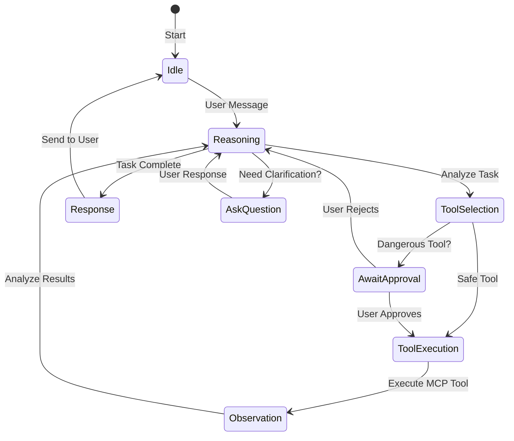
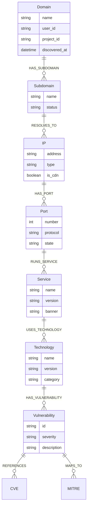
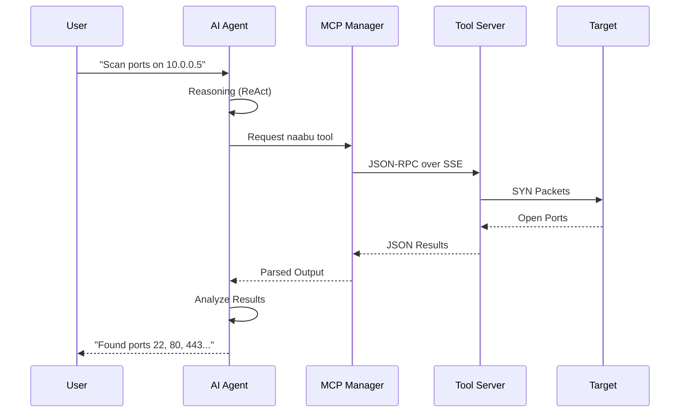

<p align="center">
  
  
</p>

> **LEGAL DISCLAIMER**: This tool is intended for **authorized security testing**, **educational purposes**, and **research only**. Never use this system to scan, probe, or attack any system you do not own or have explicit written permission to test. Unauthorized access is **illegal** and punishable by law. By using this tool, you accept **full responsibility** for your actions. **[Read Full Disclaimer](DISCLAIMER.md)**

---

# RedAmon

**Unmask the hidden before the world does.**

An AI-powered agentic red team framework that automates offensive security operations — from reconnaissance to exploitation to post-exploitation — with zero human intervention.

---

## Table of Contents

- [Overview](#overview)
- [System Architecture](#system-architecture)
  - [High-Level Architecture](#high-level-architecture)
  - [Data Flow Pipeline](#data-flow-pipeline)
  - [Docker Container Architecture](#docker-container-architecture)
- [Components](#components)
  - [Reconnaissance Pipeline](#1-reconnaissance-pipeline)
  - [Graph Database](#2-graph-database)
  - [MCP Tool Servers](#3-mcp-tool-servers)
  - [AI Agent Orchestrator](#4-ai-agent-orchestrator)
  - [Web Application](#5-web-application)
  - [GVM Scanner](#6-gvm-scanner)
  - [Test Environments](#7-test-environments)
- [Quick Start](#quick-start)
- [Documentation](#documentation)
- [Legal](#legal)

---

## Overview

RedAmon is a modular, containerized penetration testing framework that combines:

| Component | Purpose |
|-----------|---------|
| **Automated Reconnaissance** | Subdomain discovery, port scanning, HTTP probing, technology fingerprinting, vulnerability scanning |
| **Graph Database** | Neo4j-powered attack surface visualization and relationship mapping |
| **AI Agent Orchestration** | LangGraph-based autonomous decision making with ReAct pattern |
| **MCP Tool Integration** | Security tools exposed via Model Context Protocol for AI agents |
| **Web Interface** | Next.js dashboard for visualization and AI chat interaction |

---

## System Architecture

### High-Level Architecture

```mermaid
flowchart TB
    subgraph User["👤 User Layer"]
        Browser[Web Browser]
        CLI[Terminal/CLI]
    end

    subgraph Frontend["🖥️ Frontend Layer"]
        Webapp[Next.js Webapp<br/>:3000]
    end

    subgraph Backend["⚙️ Backend Layer"]
        Agent[AI Agent Orchestrator<br/>FastAPI + LangGraph<br/>:8080]
    end

    subgraph Tools["🔧 MCP Tools Layer"]
        Naabu[Naabu Server<br/>:8000]
        Curl[Curl Server<br/>:8001]
        Nuclei[Nuclei Server<br/>:8002]
        Metasploit[Metasploit Server<br/>:8003]
    end

    subgraph Data["💾 Data Layer"]
        Neo4j[(Neo4j Graph DB<br/>:7474/:7687)]
        Recon[Recon Pipeline<br/>Docker Container]
    end

    subgraph Targets["🎯 Target Layer"]
        Target[Target Systems]
        GuineaPigs[Guinea Pigs<br/>Test VMs]
    end

    Browser --> Webapp
    CLI --> Recon
    Webapp <-->|WebSocket| Agent
    Webapp --> Neo4j
    Agent --> Neo4j
    Agent -->|MCP Protocol| Naabu
    Agent -->|MCP Protocol| Curl
    Agent -->|MCP Protocol| Nuclei
    Agent -->|MCP Protocol| Metasploit
    Recon --> Neo4j
    Naabu --> Target
    Nuclei --> Target
    Metasploit --> Target
    Naabu --> GuineaPigs
    Nuclei --> GuineaPigs
    Metasploit --> GuineaPigs
```



### Data Flow Pipeline

```mermaid
flowchart TB
    subgraph Phase1["Phase 1: Reconnaissance"]
        Domain[🌐 Domain] --> Subdomains[📋 Subdomains<br/>crt.sh, HackerTarget, Knockpy]
        Subdomains --> DNS[🔍 DNS Resolution]
        DNS --> Ports[🔌 Port Scan<br/>Naabu]
        Ports --> HTTP[🌍 HTTP Probe<br/>Httpx]
        HTTP --> Tech[🔧 Tech Detection<br/>Wappalyzer]
        Tech --> Vulns[⚠️ Vuln Scan<br/>Nuclei]
    end

    subgraph Phase2["Phase 2: Data Storage"]
        Vulns --> JSON[(JSON Output)]
        JSON --> Graph[(Neo4j Graph)]
    end

    subgraph Phase3["Phase 3: AI Analysis"]
        Graph --> Agent[🤖 AI Agent]
        Agent --> Query[Natural Language<br/>→ Cypher Query]
        Query --> Graph
    end

    subgraph Phase4["Phase 4: Exploitation"]
        Agent --> MCP[MCP Tools]
        MCP --> Naabu2[Naabu<br/>Port Scan]
        MCP --> Nuclei2[Nuclei<br/>Vuln Verify]
        MCP --> MSF[Metasploit<br/>Exploit]
        MSF --> Shell[🐚 Shell/Meterpreter]
    end

    subgraph Phase5["Phase 5: Post-Exploitation"]
        Shell --> Enum[Enumeration]
        Enum --> Pivot[Lateral Movement]
        Pivot --> Exfil[Data Exfiltration]
    end
```



### Docker Container Architecture

```mermaid
flowchart TB
    subgraph Host["🖥️ Host Machine"]
        subgraph Containers["Docker Containers"]
            subgraph ReconContainer["recon-container"]
                ReconPy[Python Scripts]
                Naabu1[Naabu]
                Httpx[Httpx]
                Knockpy[Knockpy]
            end

            subgraph MCPContainer["kali-mcp-sandbox"]
                MCPServers[MCP Servers]
                NaabuTool[Naabu :8000]
                CurlTool[Curl :8001]
                NucleiTool[Nuclei :8002]
                MSFTool[Metasploit :8003]
            end

            subgraph AgenticContainer["agentic-container"]
                FastAPI[FastAPI :8080]
                LangGraph[LangGraph Engine]
                Claude[Claude AI]
            end

            subgraph Neo4jContainer["neo4j-container"]
                Neo4jDB[(Neo4j :7687)]
                Browser[Browser :7474]
            end

            subgraph WebappContainer["webapp-container"]
                NextJS[Next.js :3000]
            end

            subgraph GVMContainer["gvm-container"]
                OpenVAS[OpenVAS Scanner]
                GVMd[GVM Daemon]
            end

            subgraph GuineaContainer["guinea-pigs"]
                Apache1[Apache 2.4.25<br/>CVE-2017-3167]
                Apache2[Apache 2.4.49<br/>CVE-2021-41773]
            end
        end

        Volumes["📁 Shared Volumes"]
        ReconContainer --> Volumes
        Volumes --> Neo4jContainer
        Volumes --> GVMContainer
    end
```



### Recon Pipeline Detail

```mermaid
flowchart TB
    subgraph Input["📥 Input Configuration"]
        Params[params.py<br/>TARGET_DOMAIN<br/>SUBDOMAIN_LIST<br/>SCAN_MODULES]
        Env[.env<br/>API Keys<br/>Neo4j Credentials]
    end

    subgraph Container["🐳 recon-container (Kali Linux)"]
        Main[main.py<br/>Pipeline Orchestrator]

        subgraph Module1["1️⃣ domain_discovery"]
            WHOIS[whois_recon.py<br/>WHOIS Lookup]
            CRT[crt.sh API<br/>Certificate Transparency]
            HT[HackerTarget API<br/>Subdomain Search]
            Knock[Knockpy<br/>Active Bruteforce]
            DNS[DNS Resolution<br/>A, AAAA, MX, NS, TXT]
        end

        subgraph Module2["2️⃣ port_scan"]
            Naabu[Naabu<br/>SYN/CONNECT Scan<br/>Top 100-1000 Ports]
            Shodan[Shodan InternetDB<br/>Passive Mode]
        end

        subgraph Module3["3️⃣ http_probe"]
            Httpx[Httpx<br/>HTTP/HTTPS Probe]
            Tech[Wappalyzer Rules<br/>Technology Detection]
            Headers[Header Analysis<br/>Security Headers]
            Certs[TLS Certificate<br/>Extraction]
        end

        subgraph Module4["4️⃣ resource_enum"]
            Katana[Katana<br/>Web Crawler]
            Forms[Form Parser<br/>Input Discovery]
            Endpoints[Endpoint<br/>Classification]
        end

        subgraph Module5["5️⃣ vuln_scan"]
            Nuclei[Nuclei<br/>9000+ Templates]
            MITRE[add_mitre.py<br/>CWE/CAPEC Enrichment]
        end

        subgraph Module6["6️⃣ github"]
            GHHunter[GitHubSecretHunter<br/>Secret Detection]
        end
    end

    subgraph Output["📤 Output"]
        JSON[(recon/output/<br/>recon_domain.json)]
        Graph[(Neo4j Graph<br/>via neo4j_client.py)]
    end

    Params --> Main
    Env --> Main

    Main --> WHOIS
    WHOIS --> CRT
    CRT --> HT
    HT --> Knock
    Knock --> DNS

    DNS --> Naabu
    Naabu -.-> Shodan

    Naabu --> Httpx
    Httpx --> Tech
    Tech --> Headers
    Headers --> Certs

    Certs --> Katana
    Katana --> Forms
    Forms --> Endpoints

    Endpoints --> Nuclei
    Nuclei --> MITRE

    MITRE --> GHHunter

    GHHunter --> JSON
    JSON --> Graph
```



### Recon Module Data Flow

```mermaid
sequenceDiagram
    participant User
    participant Main as main.py
    participant DD as domain_discovery
    participant PS as port_scan
    participant HP as http_probe
    participant RE as resource_enum
    participant VS as vuln_scan
    participant JSON as JSON Output
    participant Neo4j as Neo4j Graph

    User->>Main: python main.py
    Main->>Main: Load params.py

    rect rgb(40, 40, 80)
        Note over DD: Phase 1: Domain Discovery
        Main->>DD: discover_subdomains(domain)
        DD->>DD: WHOIS lookup
        DD->>DD: crt.sh query
        DD->>DD: HackerTarget API
        DD->>DD: Knockpy bruteforce
        DD->>DD: DNS resolution (all records)
        DD-->>Main: subdomains + IPs
    end

    rect rgb(40, 80, 40)
        Note over PS: Phase 2: Port Scanning
        Main->>PS: run_port_scan(targets)
        PS->>PS: Naabu SYN scan
        PS->>PS: Service detection
        PS->>PS: CDN/WAF detection
        PS-->>Main: open ports + services
    end

    rect rgb(80, 40, 40)
        Note over HP: Phase 3: HTTP Probing
        Main->>HP: run_http_probe(targets)
        HP->>HP: HTTP/HTTPS requests
        HP->>HP: Follow redirects
        HP->>HP: Technology fingerprint
        HP->>HP: Extract headers + certs
        HP-->>Main: live URLs + tech stack
    end

    rect rgb(80, 80, 40)
        Note over RE: Phase 4: Resource Enumeration
        Main->>RE: run_resource_enum(urls)
        RE->>RE: Katana crawl
        RE->>RE: Parse forms + inputs
        RE->>RE: Classify endpoints
        RE-->>Main: endpoints + parameters
    end

    rect rgb(80, 40, 80)
        Note over VS: Phase 5: Vulnerability Scan
        Main->>VS: run_vuln_scan(targets)
        VS->>VS: Nuclei templates
        VS->>VS: CVE detection
        VS->>VS: MITRE CWE/CAPEC mapping
        VS-->>Main: vulnerabilities + CVEs
    end

    Main->>JSON: Save recon_domain.json
    Main->>Neo4j: Update graph database
    Neo4j-->>User: Graph ready for visualization
```



### Agent Workflow (ReAct Pattern)



### Graph Database Schema



### MCP Tool Integration



---

## Components

### 1. Reconnaissance Pipeline

Automated OSINT and vulnerability scanning starting from a single domain.

| Tool | Purpose |
|------|---------|
| crt.sh | Certificate Transparency subdomain discovery |
| HackerTarget | API-based subdomain enumeration |
| Knockpy | Active subdomain bruteforcing |
| Naabu | Fast port scanning |
| Httpx | HTTP probing and technology detection |
| Nuclei | Template-based vulnerability scanning |

📖 **[Read Recon Documentation](recon/README.RECON.md)**

---

### 2. Graph Database

Neo4j-powered attack surface mapping with multi-tenant support.

```
Domain → Subdomain → IP → Port → Service → Technology → Vulnerability → CVE
```

- **Browser UI**: http://localhost:7474
- **Bolt Protocol**: bolt://localhost:7687

📖 **[Read Graph DB Documentation](graph_db/readmes/README.GRAPH_DB.md)**
📖 **[View Graph Schema](graph_db/readmes/GRAPH.SCHEMA.md)**

---

### 3. MCP Tool Servers

Security tools exposed via Model Context Protocol for AI agent integration.

| Server | Port | Tool | Capability |
|--------|------|------|------------|
| naabu | 8000 | Naabu | Fast port scanning, service detection |
| curl | 8001 | Curl | HTTP requests, header inspection |
| nuclei | 8002 | Nuclei | 9000+ vulnerability templates |
| metasploit | 8003 | Metasploit | Exploitation, post-exploitation, sessions |

📖 **[Read MCP Documentation](mcp/README.MCP.md)**

---

### 4. AI Agent Orchestrator

LangGraph-based autonomous agent with ReAct pattern.

- **WebSocket Streaming**: Real-time updates to frontend
- **Phase-Aware Execution**: Human approval for dangerous operations
- **Memory Persistence**: Conversation history via MemorySaver
- **Multi-Objective Support**: Complex attack chain planning

📖 **[Read Agentic Documentation](agentic/README.AGENTIC.md)**
📖 **[Metasploit Integration Guide](agentic/README.METASPLOIT.GUIDE.md)**

---

### 5. Web Application

Next.js dashboard for visualization and AI interaction.

- **Graph Visualization**: Interactive Neo4j graph explorer
- **AI Chat Interface**: WebSocket-based agent communication
- **Node Inspector**: Detailed view of assets and relationships
- **Approval Workflows**: Confirm dangerous tool executions

📖 **[Read Webapp Documentation](webapp/README.WEBAPP.md)**

---

### 6. GVM Scanner

Greenbone Vulnerability Management (OpenVAS) for deep scanning.

- 170,000+ Network Vulnerability Tests (NVTs)
- CVSS scoring and CVE mapping
- Integrates with recon output

📖 **[Read GVM Documentation](gvm_scan/README.GVM.md)**

---

### 7. Test Environments

Intentionally vulnerable systems for safe testing.

| Environment | Vulnerability |
|-------------|--------------|
| Apache 2.4.25 | CVE-2017-3167 |
| Apache 2.4.49 | CVE-2021-41773 (Path Traversal + RCE) |

📖 **[Read Guinea Pigs Documentation](guinea_pigs/README.GPIGS.md)**

---

## Quick Start

### Prerequisites

- Docker & Docker Compose
- Python 3.11+
- Node.js 18+ (for webapp)

### 1. Start Neo4j Database

```bash
cd graph_db
docker compose up -d
```

### 2. Run Reconnaissance

```bash
cd recon
# Edit params.py with target domain
docker-compose build
docker-compose run --rm recon python /app/recon/main.py
```

### 3. Start MCP Servers

```bash
cd mcp
docker-compose up -d
```

### 4. Start AI Agent

```bash
cd agentic
docker-compose up -d
```

### 5. Start Webapp

```bash
cd webapp
npm install
npm run dev
```

### 6. Open Browser

- **Webapp**: http://localhost:3000
- **Neo4j Browser**: http://localhost:7474
- **Agent API**: http://localhost:8080

---

## Documentation

| Component | Documentation |
|-----------|---------------|
| Project Guidelines | [.claude/CLAUDE.md](.claude/CLAUDE.md) |
| Reconnaissance | [recon/README.RECON.md](recon/README.RECON.md) |
| Graph Database | [graph_db/readmes/README.GRAPH_DB.md](graph_db/readmes/README.GRAPH_DB.md) |
| Graph Schema | [graph_db/readmes/GRAPH.SCHEMA.md](graph_db/readmes/GRAPH.SCHEMA.md) |
| MCP Servers | [mcp/README.MCP.md](mcp/README.MCP.md) |
| AI Agent | [agentic/README.AGENTIC.md](agentic/README.AGENTIC.md) |
| Metasploit Guide | [agentic/README.METASPLOIT.GUIDE.md](agentic/README.METASPLOIT.GUIDE.md) |
| Webapp | [webapp/README.WEBAPP.md](webapp/README.WEBAPP.md) |
| GVM Scanner | [gvm_scan/README.GVM.md](gvm_scan/README.GVM.md) |
| Test Environments | [guinea_pigs/README.GPIGS.md](guinea_pigs/README.GPIGS.md) |
| Full Disclaimer | [DISCLAIMER.md](DISCLAIMER.md) |
| License | [LICENSE](LICENSE) |

---

## Legal

This project is released under the [MIT License](LICENSE).

See [DISCLAIMER.md](DISCLAIMER.md) for full terms of use, acceptable use policy, and legal compliance requirements.

---

<p align="center">
  <strong>Use responsibly. Test ethically. Defend better.</strong>
</p>
