# CypherFix Agents — Vulnerability Triage & Automated Code Remediation

## Overview

**CypherFix** is RedAmon's automated vulnerability remediation pipeline. It bridges the gap between discovering vulnerabilities (via reconnaissance, DAST scanning, and AI-powered pentesting) and actually fixing them in code. The pipeline consists of two independent AI agents that operate in sequence:

1. **Triage Agent** - Scores every finding in the Neo4j attack surface graph
   with a fixed risk model, groups the findings that share a fix, has an LLM
   check the evidence behind the ones it can judge, and writes one remediation
   per group. The score model is deterministic and runs with no LLM at all; see
   [Score model v3](#score-model-v3).
2. **CodeFix Agent** — Takes a single remediation entry, clones the target repository, explores the codebase, implements the fix using a ReAct loop, and opens a pull request.

Both agents run inside the existing `agent` container and communicate with the frontend via dedicated WebSocket connections.

---

## Table of Contents

1. [Architecture Overview](#architecture-overview)
2. [End-to-End Workflow](#end-to-end-workflow)
3. [Triage Agent](#triage-agent)
   - [File Structure](#triage-file-structure)
   - [The five steps](#the-five-steps-and-why-only-one-of-them-writes)
   - [Collection](#collection)
   - [Persistence](#persistence)
   - [Tools](#triage-tools)
   - [Score model v3](#score-model-v3)
   - [Grouping, review and remediation](#grouping-review-and-remediation)
   - [The run protocol](#the-run-protocol)
   - [State Model](#triage-state-model)
   - [WebSocket Protocol](#triage-websocket-protocol)
4. [CodeFix Agent](#codefix-agent)
   - [File Structure](#codefix-file-structure)
   - [ReAct Loop Architecture](#react-loop-architecture)
   - [Orchestrator Workflow](#orchestrator-workflow)
   - [Tool System](#codefix-tool-system)
   - [Diff Block & Approval Flow](#diff-block--approval-flow)
   - [GitHub Integration](#github-integration)
   - [State Model](#codefix-state-model)
   - [WebSocket Protocol](#codefix-websocket-protocol)
5. [LLM Provider Routing](#llm-provider-routing)
6. [Frontend Integration](#frontend-integration)
7. [Configuration Reference](#configuration-reference)
8. [Container & Runtime Environment](#container--runtime-environment)

---

## Architecture Overview

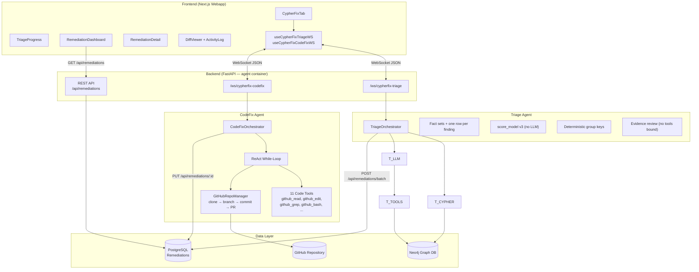

---

## End-to-End Workflow

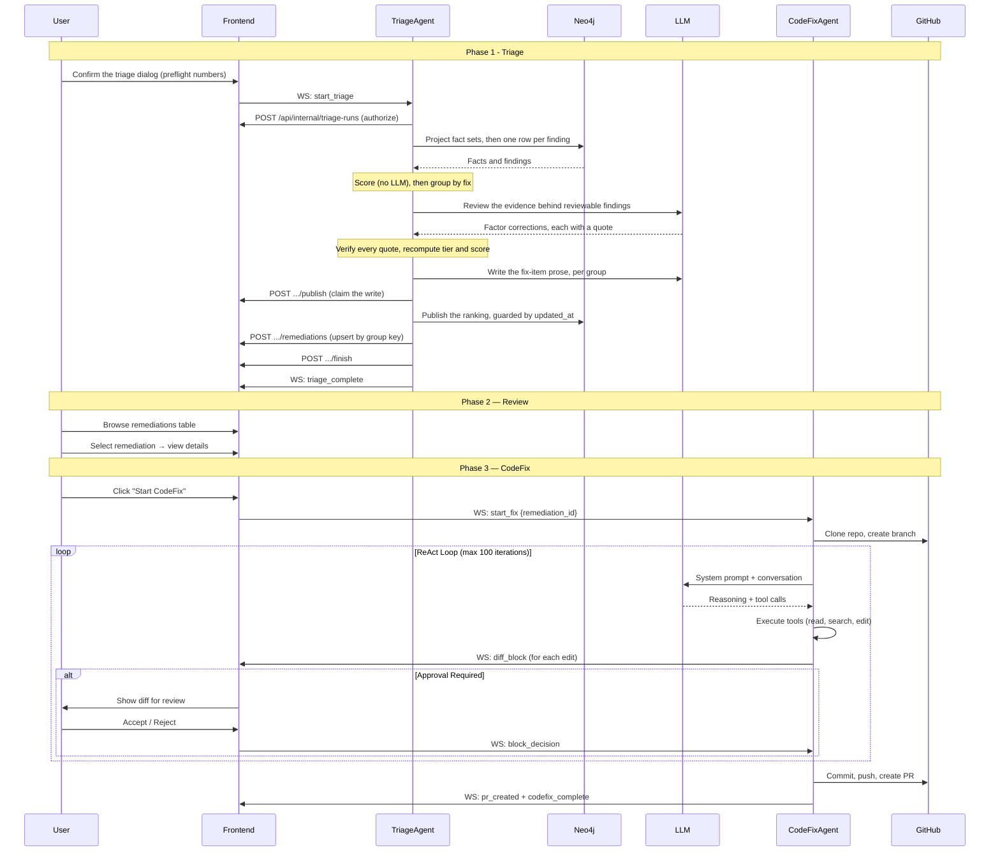

---

## Triage Agent

### Triage File Structure

```
agentic/cypherfix_triage/
├── __init__.py
├── orchestrator.py            # The five steps: score, group, review, remediate, publish
├── score_model.py             # The risk model. C x L x I x R -> tier -> 0-100. Pure
├── fact_queries.py            # Project fact sets + one row per finding
├── grouping.py                # Deterministic group keys (one problem, one fix)
├── evidence.py                # The evidence bundle, redaction, the review cache key
├── remediation.py             # Fix-item fields, every one computed in code
├── intel.py                   # KEV / EPSS / PoC via the vulnx MCP tool
├── run_client.py              # authorize, heartbeat, publish, finish
├── state.py                   # RemediationDraft, TriageState
├── tools.py                   # The Neo4j read path. No LLM tools are bound
├── project_settings.py        # Load CypherFix settings from webapp API
├── websocket_handler.py       # WebSocket endpoint + the run registry
└── prompts/
    ├── __init__.py
    ├── review.py              # the evidence-review prompt AND its output validation
    ├── remediation_prose.py   # the only thing a model writes about a fix item
    └── cypher_queries.py      # the mute-enforcing collection queries
```

### The five steps, and why only one of them writes

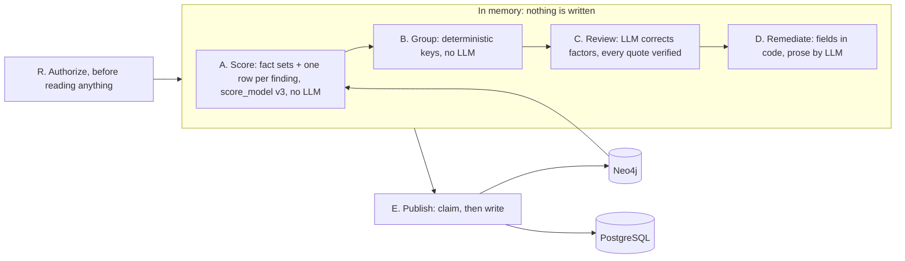

**Steps A to D happen entirely in memory; Step E is the only thing that
writes.** That single property is what makes a run safe to stop, safe to refuse
and safe to run beside a scan: until the publish is claimed, the previous
ranking is still what an operator sees, and a run that is killed halfway has
changed nothing at all.

It also gives the design its failure posture:

- the run authorises BEFORE it reads, so a run that will not be allowed to
  publish does not first spend minutes and LLM budget discovering that;
- a publish that is refused writes nothing, rather than part of a result;
- the LLM being unreachable costs detail, never the ranking: those findings
  publish as "Not reviewed" with their maths intact.

### Collection


Nine hardcoded Cypher queries run against Neo4j to collect the full attack surface:

The collection queries live in `cypherfix_triage/fact_queries.py` and come in
two kinds.

**Project fact sets**, read once per run: which hosts are live, which ports an
active scan found, which packages are actually served, what the agent proved,
which hosts appear in threat intelligence, which assets are sensitive.

**One row per finding**, per label, using `COUNT {}` / `EXISTS {}` subqueries
rather than `OPTIONAL MATCH` chains. That shape is the point: the old queries
chained OPTIONAL MATCH, so a GVM finding hanging off three Technologies plus a
Port plus a Subdomain came back five times, each scoring differently, and
whichever row Neo4j returned last won. One OSV advisory hangs off up to eleven
packages in the dev graph. Verified on a real graph: 536 findings, no duplicate
ids.

The join happens in Python, in `score_model.score(finding, facts, intel)`, which
is pure.

All queries are tenant-filtered with `$userId` and `$projectId`. They also
hand-write their own `NOT n:Muted` term: they run through `run_static_query`,
which deliberately does not go through `scope_query`, so the exclusion every
agent query gets for free is absent here.

### Persistence

Findings are published through `apply_triage_scores` in batches of 500, each row
guarded by the `updated_at` it was read at. Remediations are upserted by
`(projectId, groupKey)` in ONE transaction through
`POST /api/internal/triage-runs/[runId]/remediations`.

The old path deleted every pending remediation and then created the new ones,
outside a transaction: a failure in between left the project with no fix list at
all, and a row the CodeFix agent was working on could be deleted underneath it,
taking its branch and its PR link with it. Anything a person or CodeFix has
touched is now never rewritten.

### Triage Tools

**The triage agent binds NO tools.** It used to have `query_graph` and
`web_search`, which meant a model steered by scanner output could write its own
Cypher and its own search queries. Both are gone: Steps A to D read the graph
through the fixed queries in `cypherfix_triage/fact_queries.py`, and the review
and prose calls bind nothing at all, so an injected instruction has nothing to
reach for.

The one outbound call triage can make is `cve_intel` on the kali-sandbox MCP
server, checked against a one-name allowlist. Only CVE ids leave the machine,
regex-validated in code, and only numbers and booleans are kept from the reply.

### Score model v3

The weighted-sum algorithm is gone. It added points per signal, which counted
one fact several times (severity, CVSS score and CVSS vector all describe the
same thing), summed signals that mean the same thing (KEV + EPSS + a public
PoC), and ADDED impact to likelihood when risk is impact TIMES likelihood.

`cypherfix_triage/score_model.py` is a pure module with no I/O. For every open
finding it estimates four probabilities and multiplies them:

| Factor | Meaning | Source |
|---|---|---|
| **C** | P(the finding is real) | How it was detected: an exploit that ran, a matcher with captured proof, a QoD band, a version guess |
| **L** | P(exploited \| real) | The MAXIMUM of the exploit signals, never a sum, then capped modifiers |
| **I** | Impact | The CVSS impact sub-score, else the numeric score, else severity, else the class table |
| **R** | Reachability | A live endpoint, an actively-scanned port, a served package, a login wall, a local-only vector |

```
risk  = min(1, C x L x I x R)
tier  = T1 Act now | T2 Act soon | T3 Plan | T4 Track     (fixed rules)
score = 25 x tier_level + 25 x risk                        (0 to 100)
```

The tier is INSIDE the score, so one sort key gives "tier first, then risk" and
the tier bands meet rather than overlap.

**State is decided before the score.** A `fixed`, `gone` or `inactive` finding
leaves the ranking entirely rather than being demoted to a small number that
still sorts above something real.

Three decisions worth knowing, because each was a live defect:

- **Unknown is not info.** OSV writes `severity: info` to mean "never graded"
  (all 419 PYSEC advisories in the dev graph), so ungraded maps to 0.45, not
  0.02. This is the one place a "higher" severity word scores lower.
- **A blanket severity cannot raise a class.** The GitHub hunt stamps "high" on
  all 284 of its secrets, 119 of which are private IP addresses, so for writers
  like that the class table caps I.
- **Nothing without impact leaves Track unless it is proven**, so a famous KEV
  CVE whose own vector says `C:N/I:N/A:N` cannot be Act now.

Every table is data, so calibration is a diff of numbers rather than of code,
and `SCORE_MODEL_VERSION` changes with them. All eight guarantees of the design
are tests in `agentic/tests/test_score_model.py`; monotonicity, the missing-data
rule and group risk are checked over seeded random cases.

**C is the one factor that learns.** Every Real / False positive click is a
label for the DETECTOR that produced the finding (`detector_key`: a nuclei
template, a GVM OID, a TruffleHog detector; advisories key on the source, since
a verdict on one CVE says nothing about another). C then becomes a Beta
posterior over this user's own verdicts, with the rule-based C as its prior:

```
C = (10 x C_rule + real) / (10 + real + fp)        bounded to [0.1, 0.99]
```

Ten pseudo-counts is deliberately slow: a detector is judged on a handful of
findings at first, and three unlucky clicks must not switch a real one off. The
counts come from `detector_labels`, the only fact query scoped to `$userId`
rather than to a project, because a detector that is noise on one of your
projects is noise on the next. It is never scoped wider than one user. Proven
findings are exempt, the same rule the review obeys. With no labels stored the
rule stands unchanged, which is why the v3.1.0 ranking is byte-identical to
v3.0.0 on a graph nobody has clicked. Tests:
`agentic/tests/test_triage_detector_learning.py`.

### Grouping, review and remediation

- **Group** (`cypherfix_triage/grouping.py`): deterministic keys, no LLM. The
  same CVE from two scanners is one group; every advisory on one package is one
  group; a secret's key is a hash of its value, never the value.
- **Review** (`cypherfix_triage/evidence.py`, `prompts/review.py`): the LLM
  corrects FACTORS against quoted evidence and never produces a score. Every
  quote is verified as a substring of what was sent; an unverifiable correction
  becomes "no change". `security_check` and OSV findings never reach it.
- **Remediate** (`cypherfix_triage/remediation.py`): every field that decides
  anything is computed in code. `targetRepo` comes from project settings and
  never from model output, because it decides where CodeFix pushes.

### The run protocol

A run is a `TriageRun` row, so activation, version save, the delta preview,
import and delete can see one. Four calls, all fail-closed:

| Call | What it does |
|---|---|
| `POST /api/internal/triage-runs` | Authorise, BEFORE reading anything. Strict ownership, ignoring `ACCESS_ENFORCE` |
| `.../heartbeat` | Every 30s. The reply carries `abort`; two failures in a row are treated as one |
| `.../publish` | A conditional `running -> publishing` transition. A run that lost its claim writes nothing |
| `.../finish` | Always, from a `finally`. A run left `running` blocks activation until its heartbeat expires |

Steps A to D are entirely in memory; Step E is the only thing that writes, in
batches of 500, each row guarded by the `updated_at` it was read at, so a
finding a scan re-ingested mid-run is skipped and picked up next time.

### Triage State Model

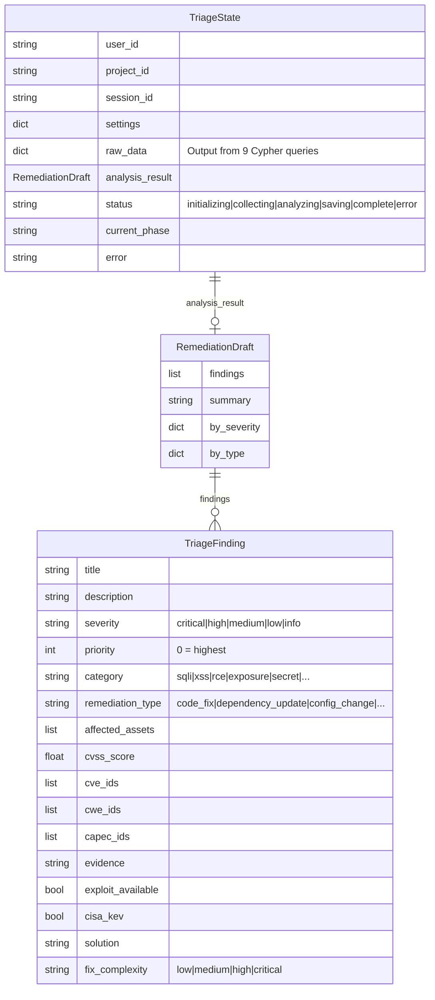

### Triage WebSocket Protocol

**Endpoint:** `/ws/cypherfix-triage`

**Incoming messages:**

| Type | Payload | Description |
|------|---------|-------------|
| `init` | `{user_id, project_id, session_id?}` | Initialize session |
| `start_triage` | — | Launch triage pipeline |
| `stop` | — | Cancel running triage |
| `ping` | — | Keepalive |

**Outgoing messages:**

| Type | Payload | Description |
|------|---------|-------------|
| `connected` | `{session_id}` | Session initialized |
| `triage_phase` | `{phase, description, progress}` | Phase update with 0–100 progress |
| `thinking` | `{thought}` | LLM reasoning text |
| `thinking_chunk` | `{chunk}` | Streaming reasoning chunk |
| `tool_start` | `{tool_name, tool_args}` | Tool execution started |
| `tool_complete` | `{tool_name, success, output_summary}` | Tool execution finished |
| `triage_complete` | `{total_remediations, by_severity, by_type, summary}` | Pipeline complete |
| `error` | `{message, recoverable}` | Error occurred |
| `stopped` | — | Triage cancelled |
| `pong` | — | Keepalive response |

---

## CodeFix Agent

### CodeFix File Structure

```
agentic/cypherfix_codefix/
├── __init__.py
├── orchestrator.py            # Pure ReAct while-loop (Claude Code pattern)
├── state.py                   # DiffBlock, CodeFixSettings, CodeFixState
├── project_settings.py        # Load CypherFix settings from webapp API
├── websocket_handler.py       # WebSocket endpoint + CodeFixStreamingCallback
├── prompts/
│   ├── __init__.py
│   ├── system.py              # Dynamic system prompt with remediation context
│   └── diff_format.py         # Instructions for structured diff output
└── tools/
    ├── __init__.py            # CODEFIX_TOOLS schema definitions (11 tools)
    ├── github_repo.py         # GitHubRepoManager: clone, branch, commit, push, PR
    ├── glob_tool.py           # File pattern matching (pathlib)
    ├── grep_tool.py           # Content search (ripgrep wrapper)
    ├── read_tool.py           # File reading with line numbers
    ├── edit_tool.py           # Exact string replacement + diff block generation
    ├── write_tool.py          # File creation/overwrite
    ├── bash_tool.py           # Shell execution with safety checks
    ├── list_dir_tool.py       # Directory listing
    ├── symbols_tool.py        # Tree-sitter AST symbol extraction
    ├── find_definition_tool.py # Symbol definition lookup
    ├── find_references_tool.py # Symbol usage finder
    └── repo_map_tool.py       # PageRank-scored codebase overview
```

### ReAct Loop Architecture

The CodeFix agent replicates **Claude Code's exact agentic design**: a pure ReAct loop where the LLM is the sole controller. There is no hardcoded state machine deciding tool order — the LLM decides which tools to use, when to retry, and when to stop. The orchestrator is simply a **while loop** that calls the LLM, executes its tool requests, feeds results back, and repeats.

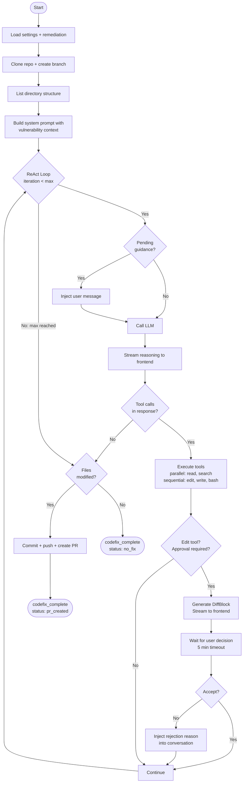

### Orchestrator Workflow

The `CodeFixOrchestrator.run()` method executes these phases:

| Phase | Action | Details |
|-------|--------|---------|
| 1. Settings | `load_cypherfix_settings()` | Fetch project config from webapp API |
| 2. Remediation | `GET /api/remediations/:id` | Load vulnerability details (title, CVEs, solution, evidence) |
| 3. Status Update | `PUT /api/remediations/:id` | Set `status: "in_progress"`, clear previous `agentNotes` |
| 4. Clone | `GitHubRepoManager.clone()` | Shallow clone (`--depth 50`), create fix branch `cypherfix/{remediation_id}` |
| 5. Explore | `github_list_dir()` | Get repo structure for system prompt |
| 6. Init LLM | `_init_llm()` | Create LangChain client based on model provider |
| 7. System Prompt | `build_codefix_system_prompt()` | Inject vulnerability details + repo structure + tool rules |
| 8. ReAct Loop | While loop (max 100 iterations) | LLM reasons → tools execute → results feed back |
| 9. Finalize | Commit → Push → PR (or no_fix) | Update remediation status in database |

### CodeFix Tool System

The agent has 11 tools available, mirroring Claude Code's tool set:

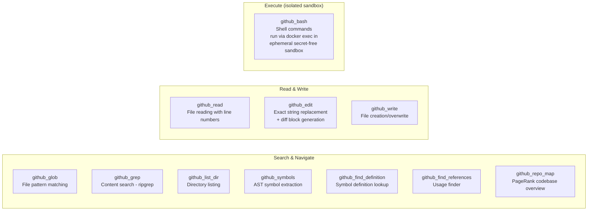

#### Tool Details

| Tool | Purpose | Key Behavior |
|------|---------|-------------|
| `github_glob` | Find files by glob pattern | Returns paths sorted by modification time, max 500 results |
| `github_grep` | Search file contents (regex) | Wraps `rg`, supports `files_with_matches`, `content`, `count` modes |
| `github_read` | Read file with line numbers | cat -n format, tracks files in `state.files_read` for edit pre-check |
| `github_edit` | Exact string replacement | Generates `DiffBlock`, streams to frontend, triggers approval flow |
| `github_write` | Create or overwrite file | Creates parent directories, adds to `state.files_modified` |
| `github_bash` | Shell command execution | **Runs in an isolated per-job sandbox container** (secret-free, network-isolated, `cap_drop=ALL`, read-only rootfs), driven via `docker exec` through the webapp→orchestrator path — never in the agent. 600s timeout. The old in-agent shell + 4-pattern blocklist is removed (closes T6/E10) |
| `github_list_dir` | List directory contents | Type indicators (file/dir) |
| `github_symbols` | Tree-sitter AST symbols | Supports 15 languages, extracts functions/classes/methods with line ranges |
| `github_find_definition` | Find symbol definitions | AST-based, skips node_modules/vendor/__pycache__ |
| `github_find_references` | Find symbol usages | AST-based, skips definition nodes and comments |
| `github_repo_map` | Ranked codebase overview | PageRank scoring by cross-reference count, respects token budget |

**Execution strategy:**
- **Parallel**: Search and read tools run concurrently via `asyncio.gather()`
- **Sequential**: Edit, write, and bash tools run one at a time (edit triggers approval check)

### Build Sandbox Isolation (threats T6 / E10)

A cloned repo is **untrusted external input** (malicious `postinstall` scripts, prompt-injected build instructions). Of the 11 tools, only `github_bash` *executes* repo content — so its execution is moved out of the agent container (which holds `INTERNAL_API_KEY`, Neo4j/Postgres creds, every per-user LLM key, and the GitHub token) into a dedicated sandbox.

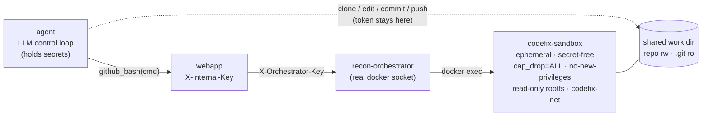

Key properties:

- **Per-job, ephemeral.** A `redamon-codefix-<job>` container is spawned at the start of a run and destroyed on completion / disconnect / TTL (a reaper cleans orphans).
- **No secrets.** The sandbox environment is empty — a full RCE during a build finds nothing to steal.
- **No internal reach.** It sits on an isolated `codefix-net` bridge with NAT egress (so `npm`/`pip` installs work) but **no RedAmon peer** — it cannot reach webapp/Neo4j/Postgres/agent.
- **Hardened runtime.** `cap_drop=ALL`, `security_opt=no-new-privileges`, read-only rootfs (writable tmpfs + worktree only), non-root user, CPU/memory/PID limits.
- **Command channel is the docker control plane**, not a shared network: the agent cannot reach the orchestrator directly, so requests flow `agent → webapp (X-Internal-Key) → orchestrator (X-Orchestrator-Key) → docker exec`. This preserves the rule that only the webapp holds the orchestrator key.
- **Token isolation.** Clone/commit/push run on the agent side with the token via `GIT_ASKPASS`; the sandbox mounts the worktree (`.git` read-only) and never sees the token.

If the sandbox image (`redamon-codefix-sandbox:latest`, built via `docker compose --profile tools build`) is missing, `github_bash` is cleanly disabled (file edits still work) — it never falls back to in-agent execution.

### Diff Block & Approval Flow

When `github_edit` executes successfully, it generates a `DiffBlock`:

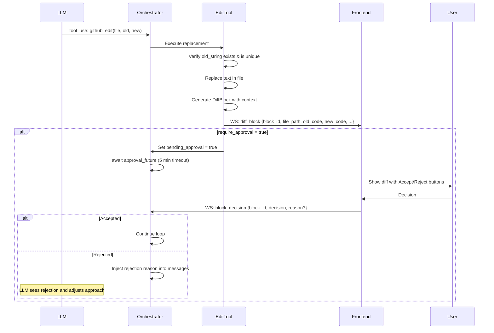

**DiffBlock fields:**

| Field | Type | Description |
|-------|------|-------------|
| `block_id` | string | Unique ID (`block-{8-hex}`) |
| `file_path` | string | Relative path from repo root |
| `language` | string | Detected from extension (python, javascript, typescript, java, go, ...) |
| `old_code` | string | Original code being replaced |
| `new_code` | string | Replacement code |
| `context_before` | string | 3 lines before the change |
| `context_after` | string | 3 lines after the change |
| `start_line` | int | 1-indexed line number where change starts |
| `end_line` | int | 1-indexed line number where change ends |
| `status` | string | `pending` → `accepted` or `rejected` |

### GitHub Integration

The `GitHubRepoManager` handles all Git and GitHub operations:

All git invocations run with hooks disabled (`-c core.hooksPath=/dev/null`) so a malicious cloned repo cannot plant a hook that fires on commit/push.

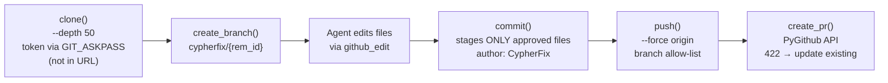

| Operation | Details |
|-----------|---------|
| **Clone** | Shallow clone to the shared work dir `{CODEFIX_WORK_BASE}/{job}/repo` (the build sandbox mounts this; `.git` mounted read-only). Token supplied via `GIT_ASKPASS` — **never in the clone URL or `.git/config`**. Removes existing dir, 120s timeout |
| **Branch** | `git checkout -b cypherfix/{remediation_id}` |
| **Commit** | Author: `CypherFix <cypherfix@redamon.io>`. **Stages only the LLM's approved files (`state.files_modified`) — never `git add -A`**, so build artifacts or files a malicious build slipped into the worktree cannot reach the PR |
| **Push** | Force-push (allows re-runs on same branch). **Branch allow-list**: refused if the target is the default branch / `main` / `master`, or does not match the configured fix-branch prefix (closes T7). Token sanitized from errors |
| **PR** | Creates via GitHub API; if 422 (already exists), finds and updates existing PR |

### CodeFix State Model

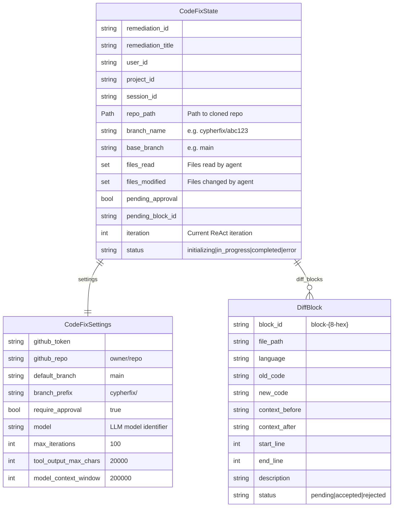

### CodeFix WebSocket Protocol

**Endpoint:** `/ws/cypherfix-codefix`

**Incoming messages:**

| Type | Payload | Description |
|------|---------|-------------|
| `init` | `{user_id, project_id, session_id?}` | Initialize session |
| `start_fix` | `{remediation_id}` | Launch CodeFix for a specific remediation |
| `block_decision` | `{block_id, decision, reason?}` | Accept or reject a diff block |
| `guidance` | `{message}` | Inject user guidance into next ReAct iteration |
| `stop` | — | Cancel running fix |
| `ping` | — | Keepalive |

**Outgoing messages:**

| Type | Payload | Description |
|------|---------|-------------|
| `connected` | `{session_id}` | Session initialized |
| `codefix_phase` | `{phase, description}` | Phase update (cloning_repo, exploring_codebase, implementing_fix, awaiting_approval) |
| `thinking` | `{thought}` | Full LLM reasoning (up to 20K chars) |
| `thinking_chunk` | `{chunk}` | Streaming reasoning chunk |
| `tool_start` | `{tool_name, tool_args}` | Tool execution started (args truncated to 200 chars) |
| `tool_complete` | `{tool_name, success, output_summary}` | Tool finished (summary truncated to 500 chars) |
| `diff_block` | `{block_id, file_path, language, old_code, new_code, ...}` | Code change for user review |
| `block_status` | `{block_id, status}` | Block accepted or rejected |
| `fix_plan` | `{plan}` | Overall fix plan from LLM |
| `pr_created` | `{pr_url, pr_number, branch, title, files_changed, additions, deletions}` | PR opened on GitHub |
| `codefix_complete` | `{remediation_id, status, pr_url?}` | Workflow complete (pr_created, no_fix, or error) |
| `error` | `{message, recoverable}` | Error occurred |
| `stopped` | — | Fix cancelled |
| `pong` | — | Keepalive response |

---

## LLM Provider Routing

Both agents share the same multi-provider routing logic:

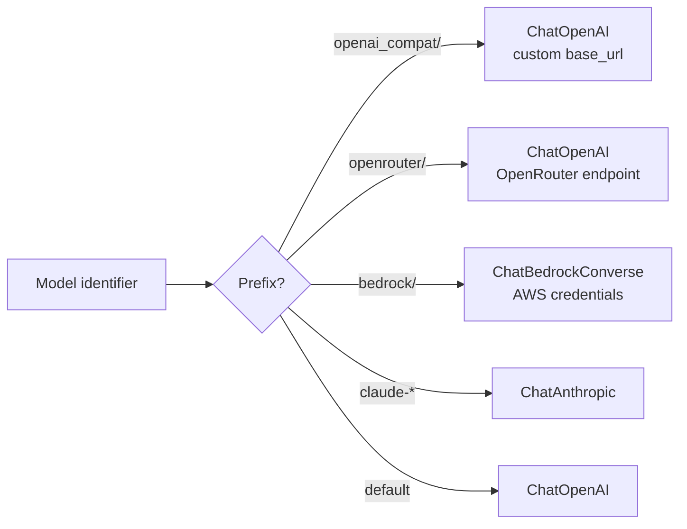

| Prefix | Provider | Required Env Var |
|--------|----------|------------------|
| `openai_compat/` | Custom OpenAI-compatible server | `OPENAI_COMPAT_BASE_URL`, `OPENAI_COMPAT_API_KEY` |
| `openrouter/` | OpenRouter | `OPENROUTER_API_KEY` |
| `bedrock/` | AWS Bedrock | `AWS_ACCESS_KEY_ID`, `AWS_SECRET_ACCESS_KEY` |
| `claude-*` | Anthropic | `ANTHROPIC_API_KEY` |
| _(default)_ | OpenAI | `OPENAI_API_KEY` |

Both agents use `temperature=0` for deterministic output. Triage uses `max_tokens=16384`, CodeFix uses `max_tokens=8192`.

---

## Frontend Integration

### Component Tree

```
CypherFixTab
├── EmptyState                         # No remediations yet — "Start Triage" prompt
├── TriageProgress                     # Live triage progress bar + phase indicator
├── RemediationDashboard               # Table of all remediations
│   ├── RemediationFilters             # Severity/status/type filters
│   ├── SeverityBadge                  # Color-coded severity tag
│   ├── StatusBadge                    # Status indicator (pending, in_progress, pr_created, ...)
│   └── RemediationTypeIcon            # Icon for code_fix, dependency_update, etc.
├── RemediationDetail                  # Single remediation detail view
│   ├── EvidenceSection                # Evidence display
│   ├── SolutionSection                # AI-suggested solution
│   └── CodeFixButton                  # "Start CodeFix Agent" trigger
└── DiffViewer                         # CodeFix live activity view
    ├── ActivityLog                    # Chronological log of all agent events
    ├── DiffBlock                      # Individual code diff with syntax highlighting
    │   ├── FileHeader                 # File path + language badge
    │   └── DiffLine                   # Single diff line (addition/deletion/context)
    └── BlockActions                   # Accept/Reject buttons
```

### WebSocket Hooks

| Hook | Endpoint | Purpose |
|------|----------|---------|
| `useCypherFixTriageWS` | `/ws/cypherfix-triage` | Manages triage session, progress tracking |
| `useCypherFixCodeFixWS` | `/ws/cypherfix-codefix` | Manages codefix session, activity log, diff blocks, approval flow |

### Standalone Page

`/cypherfix` — A dedicated page (`webapp/src/app/cypherfix/page.tsx`) that provides a standalone remediations dashboard outside the graph view, accessible from the global header.

---

## Configuration Reference

CypherFix settings are stored per-project in the PostgreSQL `Project` model and loaded at runtime:

| Setting | DB Field | Default | Used By |
|---------|----------|---------|---------|
| GitHub Token | `cypherfixGithubToken` | — | CodeFix (repo operations) |
| Default Repository | `cypherfixDefaultRepo` | — | CodeFix (clone target) |
| Default Branch | `cypherfixDefaultBranch` | `main` | CodeFix (base branch) |
| Branch Prefix | `cypherfixBranchPrefix` | `cypherfix/` | CodeFix (fix branch naming) |
| Require Approval | `cypherfixRequireApproval` | `true` | CodeFix (user must approve each edit) |
| LLM Model | `cypherfixLlmModel` | — | Both agents (fallback: `agentOpenaiModel`) |

### Environment Variables

| Variable | Default | Description |
|----------|---------|-------------|
| `WEBAPP_API_URL` | `http://webapp:3000` | Webapp API base URL |
| `CYPHERFIX_REPOS_BASE` | `/tmp/cypherfix-repos` | Base directory for cloned repos |
| `NEO4J_URI` | `bolt://neo4j:7687` | Neo4j connection (triage) |
| `NEO4J_USER` | `neo4j` | Neo4j username |
| `NEO4J_PASSWORD` | `redamon_neo4j` | Neo4j password |
| `TAVILY_API_KEY` | — | Tavily web search API key (triage) |
| `OPENAI_API_KEY` | — | OpenAI API key |
| `ANTHROPIC_API_KEY` | — | Anthropic API key |
| `OPENROUTER_API_KEY` | — | OpenRouter API key |
| `OPENAI_COMPAT_BASE_URL` | — | Custom OpenAI-compatible endpoint |
| `OPENAI_COMPAT_API_KEY` | — | Custom OpenAI-compatible API key |
| `AWS_ACCESS_KEY_ID` | — | AWS credentials for Bedrock |
| `AWS_SECRET_ACCESS_KEY` | — | AWS credentials for Bedrock |

---

## Container & Runtime Environment

Both agents run inside the existing `agent` Docker container. The container ships with a full set of language runtimes so the CodeFix agent can build, test, and lint any target repository:

| Runtime | Version | Commands |
|---------|---------|----------|
| **Node.js** | 20 LTS | `node`, `npm`, `npx`, `yarn`, `pnpm` |
| **Python** | 3.11 | `python3`, `pip` |
| **Go** | 1.22 | `go build`, `go test`, `go mod` |
| **Ruby** | 3.3 | `ruby`, `gem`, `bundler` |
| **Java** | OpenJDK 21 | `java`, `javac`, `mvn` |
| **PHP** | 8.4 | `php`, `composer` |
| **.NET** | SDK 8.0 | `dotnet build`, `dotnet test` |
| **Build tools** | — | `make`, `gcc`, `g++` |
| **Utilities** | — | `git`, `ripgrep (rg)`, `jq`, `curl`, `wget`, `unzip`, `file`, `ssh` |

### Docker Compose

```yaml
agent:
  volumes:
    - ./agentic:/app                          # Source code (live mount)
    - cypherfix-repos:/tmp/cypherfix-repos    # Cloned repos for CodeFix
```

The `cypherfix-repos` named volume provides persistent storage for cloned repositories during CodeFix runs. Repos are cleaned up after each session.

### System Prompt

The CodeFix system prompt is dynamically built per-remediation and includes:
- Agent identity and ReAct behavior rules
- Available runtimes and tools
- Vulnerability details (title, severity, CVEs, affected assets, evidence, solution)
- Repository structure (from `github_list_dir`)
- Tool usage rules (read before edit, uniqueness checks, indentation preservation)
- Security guidelines (parameterized queries, output encoding, allow-lists)
