# RedAmon Reconnaissance Module

**Unmask the hidden before the world does.**

An automated OSINT reconnaissance and vulnerability scanning framework combining multiple security tools for comprehensive target assessment.

---

## Table of Contents

- [Quick Start](#-docker-quick-start-recommended)
- [Architecture](#-docker-in-docker-architecture)
- [Pipeline Overview](#-scanning-pipeline-overview)
- [Scan Modules](#-scan-modules-explained)
- [Tool Comparison](#-complete-tool-comparison)
- [Configuration](#-key-configuration-parameters)
- [Prerequisites](#-prerequisites)
- [Project Structure](#-project-structure)
- [Output Format](#-output-format)
- [Test Targets](#-test-targets)

---

## 🐳 Docker Quick Start (Recommended)

The recon module is fully containerized. All tools run inside Docker containers.

```bash
# 1. Configure target in recon/params.py
TARGET_DOMAIN = "testphp.vulnweb.com"    # Root domain to scan
SUBDOMAIN_LIST = []                       # Empty = discover all subdomains

# 2. Build the container (first time only)
cd recon/
docker-compose build

# 3. Run a scan (starts, executes, and removes container automatically)
docker-compose run --rm recon python /app/recon/main.py
```

### Docker Environment Variables

Override `params.py` settings via environment variables:

```bash
# Run with custom target
TARGET_DOMAIN=example.com docker-compose run --rm recon python /app/recon/main.py

# Run with Tor anonymity
USE_TOR_FOR_RECON=true docker-compose run --rm recon python /app/recon/main.py

# Run specific modules only
SCAN_MODULES="domain_discovery,port_scan,http_probe" docker-compose run --rm recon python /app/recon/main.py
```

### When to Rebuild

| Change Type | Action Required |
|-------------|-----------------|
| `params.py` changes | No rebuild needed (mounted as volume) |
| Python code (*.py) changes | `docker-compose build` |
| `requirements.txt` changes | `docker-compose build --no-cache` |
| `Dockerfile` changes | `docker-compose build --no-cache` |
| `.env` file changes | No rebuild needed (mounted as volume) |

---

## 🏗️ Docker-in-Docker Architecture

The recon module uses a **Docker-in-Docker (DinD)** pattern where the main recon container orchestrates sibling containers for each scanning tool.

### How It Works

The recon container shares the **host's Docker daemon** via a socket mount, meaning all containers are **siblings** managed by the same host Docker daemon.

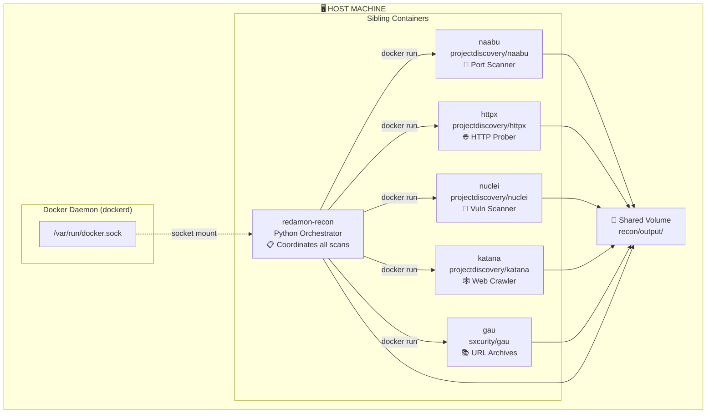

### Container Execution Flow

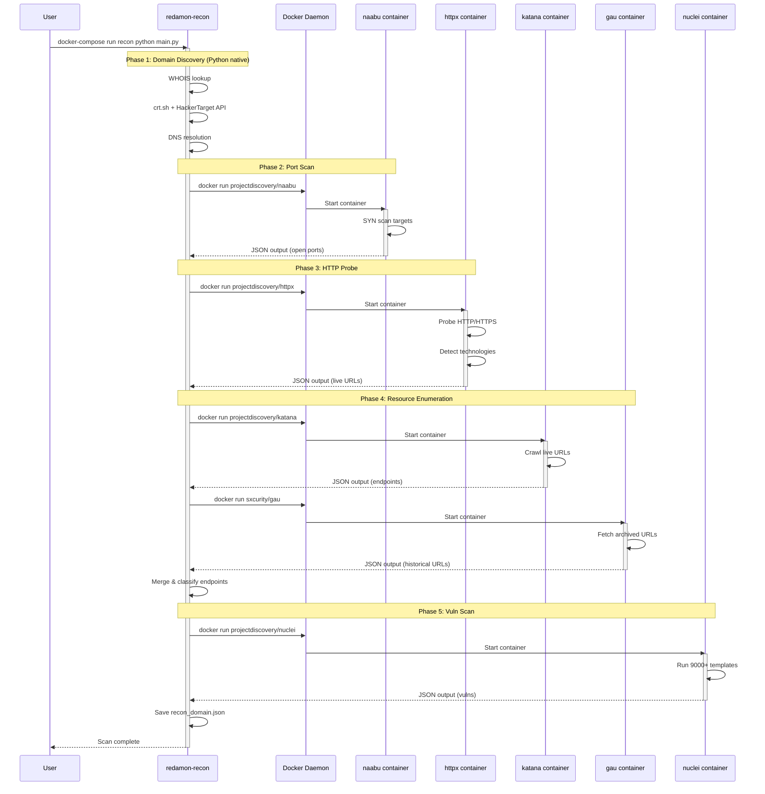

### Why Docker-in-Docker?

| Benefit | Description |
|---------|-------------|
| **Isolation** | Each tool runs in its own container with minimal dependencies |
| **Consistency** | Same tool versions regardless of host OS |
| **No host pollution** | Go binaries (naabu, httpx, nuclei) don't need to be installed on host |
| **Easy updates** | Just pull new Docker images to update tools |
| **Portability** | Works on any system with Docker installed |

---

## 🔄 Scanning Pipeline Overview

RedAmon executes scans in a modular pipeline. Each module adds data to a single JSON output file.

### High-Level Pipeline

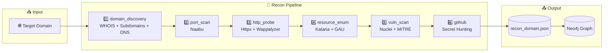

### Detailed Module Flow

```mermaid
flowchart TB
    subgraph Phase1["Phase 1: Domain Discovery"]
        direction TB
        Start([🌐 TARGET_DOMAIN]) --> WHOIS[WHOIS Lookup<br/>Registrar, dates, contacts]
        WHOIS --> SubD[Subdomain Discovery]

        subgraph SubSources["Subdomain Sources"]
            CRT[crt.sh<br/>Certificate Transparency]
            HT[HackerTarget API<br/>DNS records]
            Knock[Knockpy<br/>Bruteforce]
        end

        SubD --> CRT
        SubD --> HT
        SubD --> Knock

        CRT --> Merge[Merge & Dedupe]
        HT --> Merge
        Knock --> Merge

        Merge --> DNS[DNS Resolution<br/>A, AAAA, MX, NS, TXT, CNAME]
        DNS --> Out1[(Subdomains + IPs)]
    end

    subgraph Phase2["Phase 2: Port Scanning"]
        direction TB
        Out1 --> Naabu[Naabu Port Scanner]

        subgraph NaabuOpts["Scan Options"]
            SYN[SYN Scan<br/>Fast, requires root]
            Connect[CONNECT Scan<br/>Slower, no root needed]
            Passive[Shodan InternetDB<br/>No packets sent]
        end

        Naabu --> SYN
        Naabu --> Connect
        Naabu -.-> Passive

        SYN --> CDN{CDN Detected?}
        Connect --> CDN
        Passive --> CDN

        CDN -->|Yes| Skip[Skip CDN IPs]
        CDN -->|No| Out2[(Open Ports + Services)]
        Skip --> Out2
    end

    subgraph Phase3["Phase 3: HTTP Probing"]
        direction TB
        Out2 --> Httpx[Httpx HTTP Prober]

        subgraph HttpxFeatures["Detection Features"]
            Live[Live URL Check<br/>Status codes]
            Tech[Technology Detection<br/>Wappalyzer enhanced]
            TLS[TLS/SSL Analysis<br/>Certs, ciphers]
            Headers[Header Analysis<br/>Security headers]
        end

        Httpx --> Live
        Httpx --> Tech
        Httpx --> TLS
        Httpx --> Headers

        Live --> Out3[(Live URLs + Tech Stack)]
        Tech --> Out3
        TLS --> Out3
        Headers --> Out3
    end

    subgraph Phase4["Phase 4: Resource Enumeration"]
        direction TB
        Out3 --> ResEnum[Resource Enumeration]

        subgraph EnumTools["Discovery Methods (Parallel)"]
            Katana[Katana<br/>Active Crawling<br/>Current site structure]
            GAU[GAU<br/>Passive Archives<br/>Historical URLs]
            KR[Kiterunner<br/>API Bruteforce<br/>Hidden endpoints]
        end

        ResEnum --> Katana
        ResEnum --> GAU
        ResEnum --> KR

        Katana --> MergeURL[Merge & Classify]
        GAU --> MergeURL
        KR --> MergeURL

        MergeURL --> Out4[(Endpoints + Parameters)]
    end

    subgraph Phase5["Phase 5: Vulnerability Scanning"]
        direction TB
        Out4 --> Nuclei[Nuclei Scanner]

        subgraph NucleiFeatures["Scan Types"]
            CVE[CVE Detection<br/>Known vulnerabilities]
            DAST[DAST Fuzzing<br/>XSS, SQLi, SSTI]
            Misconfig[Misconfiguration<br/>Exposed panels, defaults]
            Info[Info Disclosure<br/>Backup files, .git]
        end

        Nuclei --> CVE
        Nuclei --> DAST
        Nuclei --> Misconfig
        Nuclei --> Info

        CVE --> MITRE[MITRE Enrichment<br/>CWE + CAPEC]
        DAST --> MITRE
        Misconfig --> MITRE
        Info --> MITRE

        MITRE --> Out5[(Vulnerabilities + Attack Patterns)]
    end

    subgraph Phase6["Phase 6: GitHub Hunting"]
        direction TB
        Out5 --> GitHub[GitHub Secret Hunter]

        subgraph Secrets["Secret Types"]
            API[API Keys<br/>AWS, GCP, Stripe]
            Creds[Credentials<br/>Passwords, tokens]
            Keys[Private Keys<br/>SSH, SSL]
            DB[Database Strings<br/>Connection strings]
        end

        GitHub --> API
        GitHub --> Creds
        GitHub --> Keys
        GitHub --> DB

        API --> Out6[(Exposed Secrets)]
        Creds --> Out6
        Keys --> Out6
        DB --> Out6
    end

    subgraph FinalOutput["📤 Final Output"]
        Out6 --> FinalJSON[(recon_domain.json)]
        FinalJSON --> Neo4j[(Neo4j Graph DB)]
    end
```

### Data Enrichment Flow

```mermaid
flowchart LR
    subgraph Discovery["Discovery Phase"]
        Sub[Subdomains] --> IP[IP Addresses]
        IP --> Port[Open Ports]
        Port --> Service[Services]
    end

    subgraph Analysis["Analysis Phase"]
        Service --> URL[Live URLs]
        URL --> Tech[Technologies]
        Tech --> Endpoint[Endpoints]
    end

    subgraph Assessment["Assessment Phase"]
        Endpoint --> Vuln[Vulnerabilities]
        Vuln --> CVE[CVE IDs]
        CVE --> CWE[CWE Weaknesses]
        CWE --> CAPEC[CAPEC Attacks]
    end

    subgraph Graph["Graph Storage"]
        CAPEC --> Neo4j[(Neo4j)]
    end
```

---

## 📋 Scan Modules Explained

### Configure Which Modules to Run

Edit `params.py`:

```python
# Run all modules (recommended for full assessment)
SCAN_MODULES = ["domain_discovery", "port_scan", "http_probe", "resource_enum", "vuln_scan", "github"]

# Quick recon only (no vulnerability scanning)
SCAN_MODULES = ["domain_discovery"]

# Port scan + HTTP probing (skip vulnerability scanning)
SCAN_MODULES = ["domain_discovery", "port_scan", "http_probe"]
```

### Module 1: `domain_discovery`

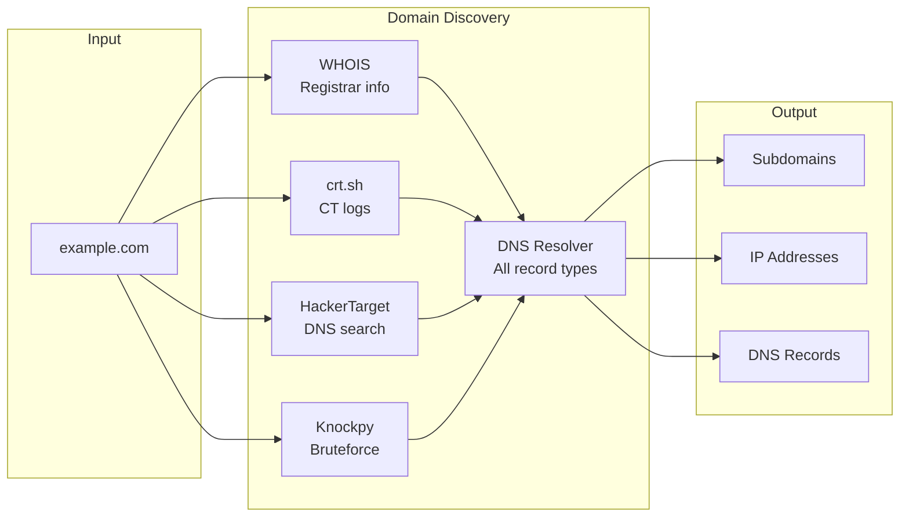

| What It Does | Output |
|--------------|--------|
| **WHOIS lookup** | Registrar, creation date, owner info |
| **Subdomain discovery** | Finds subdomains via passive sources |
| **DNS enumeration** | A, AAAA, MX, NS, TXT, CNAME records |
| **IP resolution** | Maps all discovered hostnames to IPs |

📖 **Key Parameters:**
```python
TARGET_DOMAIN = "example.com"           # Root domain
SUBDOMAIN_LIST = []                     # Empty = discover ALL
USE_BRUTEFORCE_FOR_SUBDOMAINS = False   # Brute force mode
```

---

### Module 2: `port_scan`

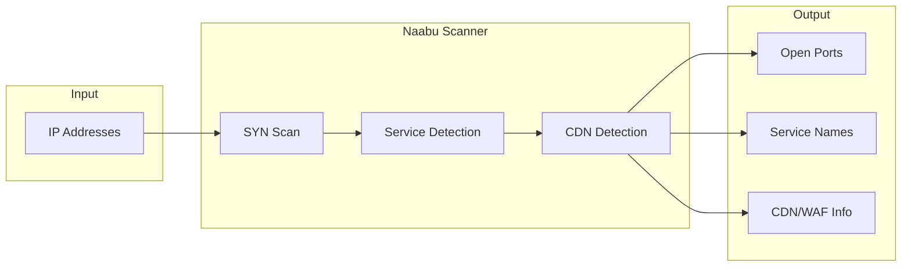

| What It Finds | Examples |
|---------------|----------|
| **Open ports** | 22/SSH, 80/HTTP, 443/HTTPS, 3306/MySQL |
| **CDN detection** | Cloudflare, Akamai, Fastly |
| **Service hints** | Common service identification |

📖 **Key Parameters:**
```python
NAABU_TOP_PORTS = "1000"        # Number of top ports
NAABU_RATE_LIMIT = 1000         # Packets per second
NAABU_SCAN_TYPE = "s"           # SYN scan
```

📖 **Detailed documentation:** [readmes/README.PORT_SCAN.md](readmes/README.PORT_SCAN.md)

---

### Module 3: `http_probe`

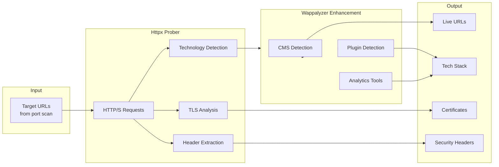

| What It Finds | Examples |
|---------------|----------|
| **Live URLs** | Which endpoints are responding |
| **Technologies** | WordPress, nginx, PHP, React |
| **CMS Plugins** | Yoast SEO, WooCommerce (via Wappalyzer) |
| **TLS certificates** | Issuer, expiry, SANs |

📖 **Detailed documentation:** [readmes/README.HTTP_PROBE.md](readmes/README.HTTP_PROBE.md)

---

### Module 4: `resource_enum`

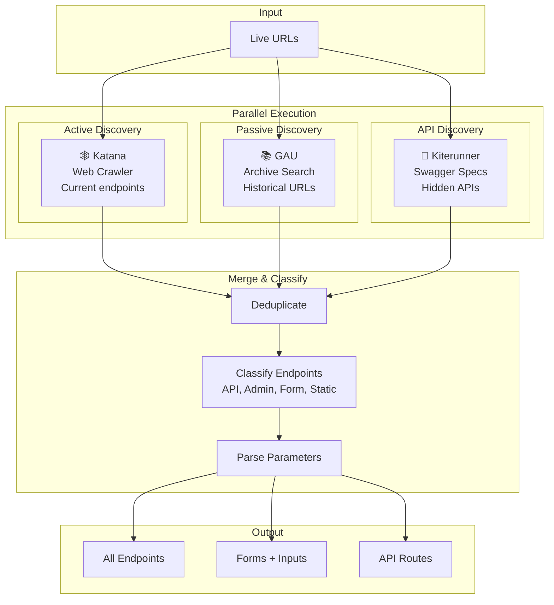

| Tool | Method | What It Finds |
|------|--------|---------------|
| **Katana** | Active crawling | Current live endpoints |
| **GAU** | Passive archives | Historical/deleted pages |
| **Kiterunner** | API bruteforce | Hidden API routes |

📖 **Detailed documentation:** [readmes/README.RESOURCE_ENUM.md](readmes/README.RESOURCE_ENUM.md)

---

### Module 5: `vuln_scan`

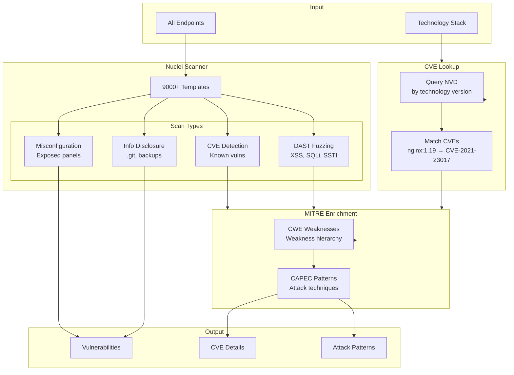

| What It Finds | Examples |
|---------------|----------|
| **Web CVEs** | Log4Shell, Spring4Shell |
| **Injection flaws** | SQL injection, XSS |
| **Misconfigurations** | Exposed admin panels |
| **CWE Weaknesses** | Weakness hierarchy |
| **CAPEC Attacks** | Attack techniques |

📖 **Detailed documentation:** [readmes/README.VULN_SCAN.md](readmes/README.VULN_SCAN.md) | [readmes/README.MITRE.md](readmes/README.MITRE.md)

---

### Module 6: `github`

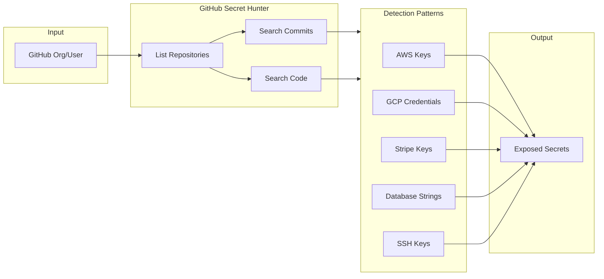

---

## 🆚 Complete Tool Comparison

### Overview Matrix

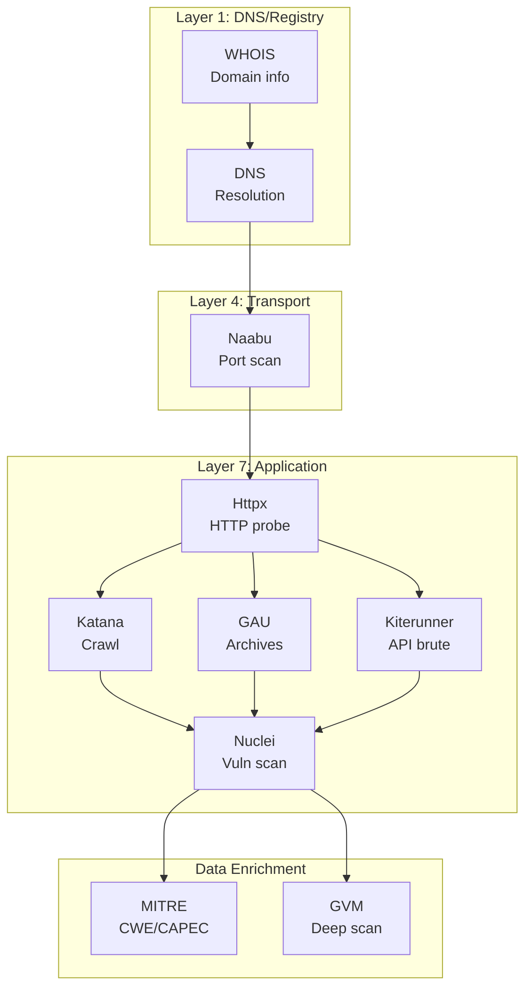

### Feature Comparison

| Feature | WHOIS | DNS | Naabu | httpx | Katana | GAU | Kiterunner | Nuclei | GVM |
|---------|-------|-----|-------|-------|--------|-----|------------|--------|-----|
| **Domain Info** | ✅ | ⚠️ | ❌ | ❌ | ❌ | ❌ | ❌ | ❌ | ❌ |
| **IP Resolution** | ❌ | ✅ | ⚠️ | ✅ | ❌ | ❌ | ❌ | ❌ | ❌ |
| **Port Scanning** | ❌ | ❌ | ✅ | ❌ | ❌ | ❌ | ❌ | ❌ | ✅ |
| **Live URL Check** | ❌ | ❌ | ❌ | ✅ | ❌ | ❌ | ❌ | ❌ | ❌ |
| **Tech Detection** | ❌ | ❌ | ❌ | ✅ | ❌ | ❌ | ❌ | ⚠️ | ⚠️ |
| **Endpoint Discovery** | ❌ | ❌ | ❌ | ❌ | ✅ | ✅ | ✅ | ❌ | ❌ |
| **Historical URLs** | ❌ | ❌ | ❌ | ❌ | ❌ | ✅ | ❌ | ❌ | ❌ |
| **API Discovery** | ❌ | ❌ | ❌ | ❌ | ❌ | ❌ | ✅ | ❌ | ❌ |
| **CVE Detection** | ❌ | ❌ | ❌ | ❌ | ❌ | ❌ | ❌ | ✅ | ✅ |
| **XSS/SQLi Testing** | ❌ | ❌ | ❌ | ❌ | ❌ | ❌ | ❌ | ✅ | ⚠️ |

**Legend:** ✅ Primary | ⚠️ Limited | ❌ Not supported

### Timing Comparison

| Tool | Typical Duration | Notes |
|------|------------------|-------|
| WHOIS | <1 second | Instant |
| DNS | <1 second | Instant |
| Naabu | 5-10 seconds | 1000 ports |
| httpx | 10-30 seconds | All options |
| Katana | 1-5 minutes | Crawl depth 3 |
| GAU | 10-30 seconds | Passive |
| Nuclei | 1-30 minutes | Depends on templates |
| GVM | 30 min - 2+ hours | Full scan |

---

## ⚙️ Key Configuration Parameters

### Essential Settings (`params.py`)

```python
# ═══════════════════════════════════════════════════════════════════
# TARGET & MODULES
# ═══════════════════════════════════════════════════════════════════
TARGET_DOMAIN = "example.com"
SUBDOMAIN_LIST = []                   # Empty = discover all
SCAN_MODULES = ["domain_discovery", "port_scan", "http_probe", "vuln_scan"]

# ═══════════════════════════════════════════════════════════════════
# PORT SCAN
# ═══════════════════════════════════════════════════════════════════
NAABU_TOP_PORTS = "1000"
NAABU_RATE_LIMIT = 1000
NAABU_SCAN_TYPE = "s"                 # SYN scan

# ═══════════════════════════════════════════════════════════════════
# HTTP PROBE
# ═══════════════════════════════════════════════════════════════════
HTTPX_THREADS = 50
HTTPX_PROBE_TECH_DETECT = True
WAPPALYZER_ENABLED = True

# ═══════════════════════════════════════════════════════════════════
# VULNERABILITY SCAN
# ═══════════════════════════════════════════════════════════════════
NUCLEI_DAST_MODE = True
NUCLEI_SEVERITY = ["critical", "high", "medium", "low"]
NUCLEI_AUTO_UPDATE_TEMPLATES = True

# ═══════════════════════════════════════════════════════════════════
# MITRE ENRICHMENT
# ═══════════════════════════════════════════════════════════════════
MITRE_INCLUDE_CWE = True
MITRE_INCLUDE_CAPEC = True
```

---

## 🔧 Prerequisites

### Docker Mode (Recommended)

- **Docker** with Docker Compose
- **Docker socket access** for nested container execution

```bash
# Verify Docker is running
docker info

# Build and run
cd recon/
docker-compose build --network=host
docker-compose run --rm recon python /app/recon/main.py
```

### Tool Containers (auto-pulled)

| Tool | Docker Image | Purpose |
|------|--------------|---------|
| Naabu | `projectdiscovery/naabu:latest` | Port scanning |
| httpx | `projectdiscovery/httpx:latest` | HTTP probing |
| Nuclei | `projectdiscovery/nuclei:latest` | Vuln scanning |
| Katana | `projectdiscovery/katana:latest` | Web crawling |
| GAU | `sxcurity/gau:latest` | URL discovery |

---

## 📁 Project Structure

```
recon/
├── Dockerfile              # Container build
├── docker-compose.yml      # Orchestration
├── params.py               # 🎛️ Configuration (edit this!)
├── main.py                 # 🚀 Entry point
├── domain_recon.py         # Subdomain discovery
├── whois_recon.py          # WHOIS lookup
├── port_scan.py            # Port scanning
├── http_probe.py           # HTTP probing
├── resource_enum.py        # Endpoint discovery
├── vuln_scan.py            # Vulnerability scanning
├── add_mitre.py            # MITRE enrichment
├── github_secret_hunt.py   # GitHub secrets
├── output/                 # 📄 Scan results (JSON)
├── data/                   # 📦 Cached databases
│   ├── mitre_db/           # CVE2CAPEC database
│   └── wappalyzer/         # Technology rules
├── helpers/                # Tool helpers
└── readmes/                # 📖 Module docs
```

---

## 📊 Output Format

All modules write to: `recon/output/recon_<domain>.json`

```mermaid
flowchart TB
    subgraph JSON["recon_domain.json"]
        Meta[metadata<br/>scan info, timestamps]
        WHOIS[whois<br/>registrar, dates]
        Subs[subdomains<br/>discovered hosts]
        DNSData[dns<br/>A, MX, TXT records]
        Ports[port_scan<br/>open ports, services]
        HTTP[http_probe<br/>live URLs, tech stack]
        Resources[resource_enum<br/>endpoints, forms]
        Vulns[vuln_scan<br/>CVEs, misconfigs]
        TechCVE[technology_cves<br/>version-based CVEs]
    end

    Meta --> WHOIS
    WHOIS --> Subs
    Subs --> DNSData
    DNSData --> Ports
    Ports --> HTTP
    HTTP --> Resources
    Resources --> Vulns
    Vulns --> TechCVE
```

---

## 🧪 Test Targets

Safe, **legal** targets for security testing:

| Target | Technology | Vulnerabilities |
|--------|------------|-----------------|
| `testphp.vulnweb.com` | PHP + MySQL | SQLi, XSS, LFI |
| `testhtml5.vulnweb.com` | HTML5 | DOM XSS |
| `testasp.vulnweb.com` | ASP.NET | SQLi, XSS |
| `scanme.nmap.org` | N/A | Port scanning only |

```python
# Example configuration
TARGET_DOMAIN = "vulnweb.com"
SUBDOMAIN_LIST = ["testphp."]
NUCLEI_DAST_MODE = True
```

---

## ⚠️ Legal Disclaimer

**Only scan systems you own or have explicit written permission to test.**

Unauthorized scanning is illegal. RedAmon is intended for:
- Penetration testers with proper authorization
- Security researchers on approved targets
- Bug bounty hunters within program scope
- System administrators testing their infrastructure

---

## 📖 Detailed Documentation

| Module | Documentation |
|--------|---------------|
| Port Scan | [readmes/README.PORT_SCAN.md](readmes/README.PORT_SCAN.md) |
| HTTP Probe | [readmes/README.HTTP_PROBE.md](readmes/README.HTTP_PROBE.md) |
| Vuln Scan | [readmes/README.VULN_SCAN.md](readmes/README.VULN_SCAN.md) |
| MITRE CWE/CAPEC | [readmes/README.MITRE.md](readmes/README.MITRE.md) |
| GVM/OpenVAS | [../gvm_scan/README.GVM.md](../gvm_scan/README.GVM.md) |
